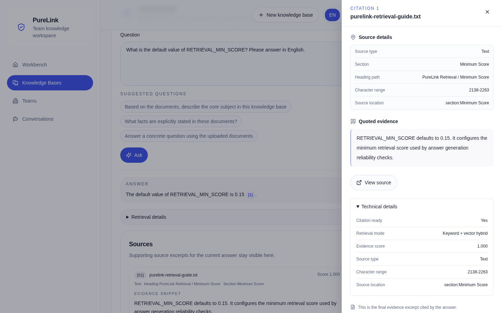
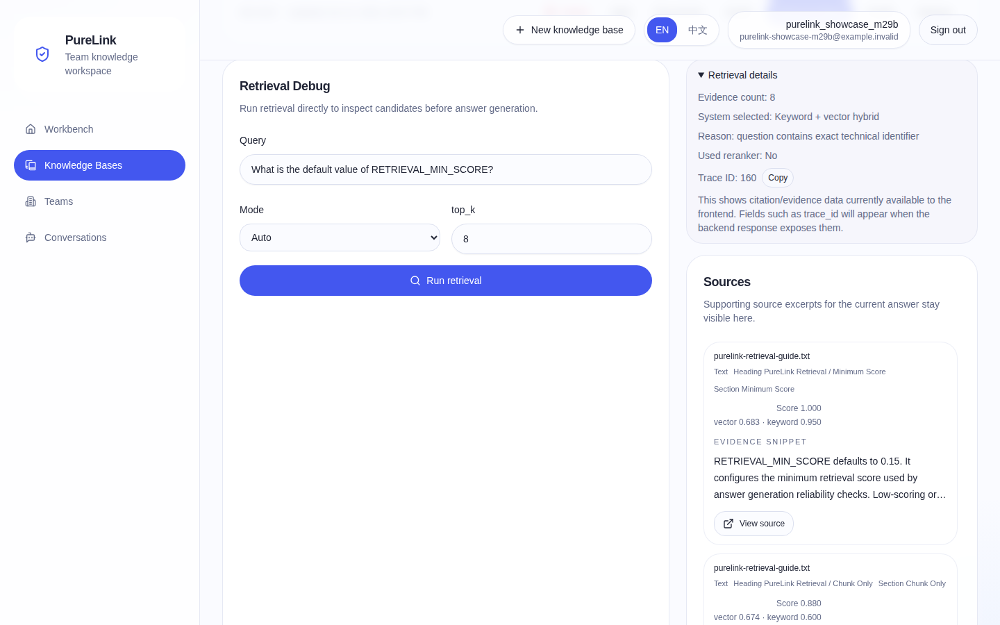
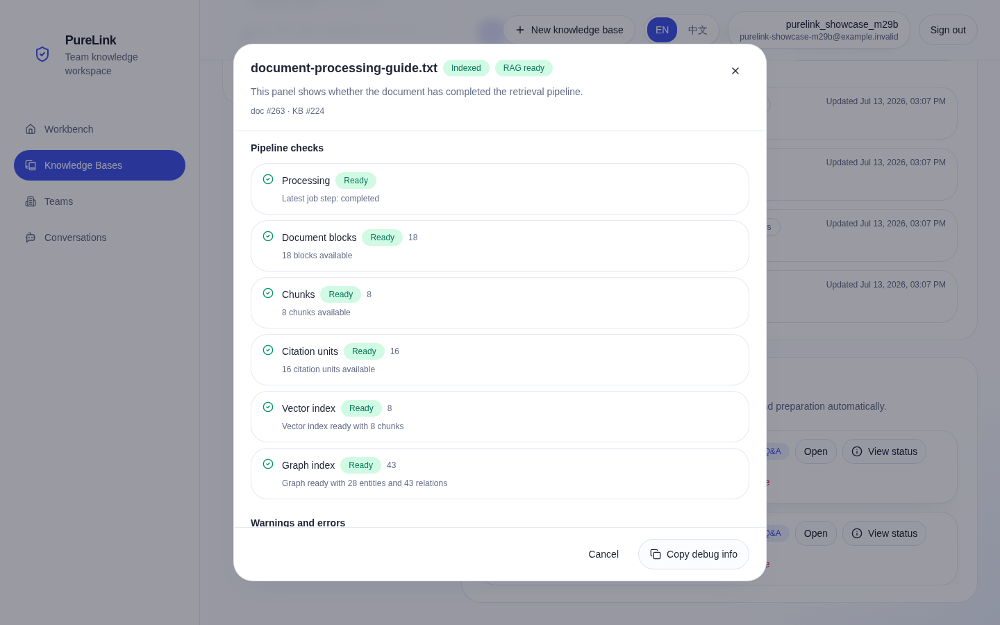
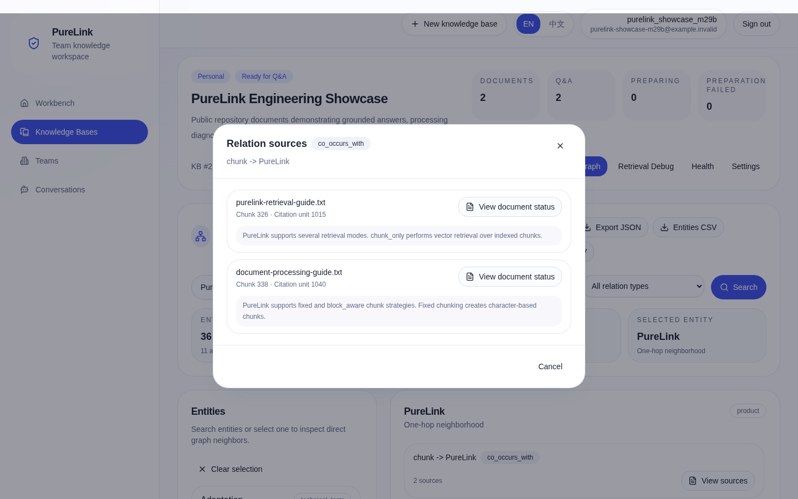
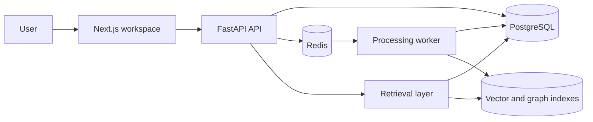
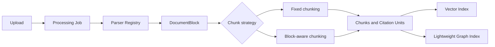
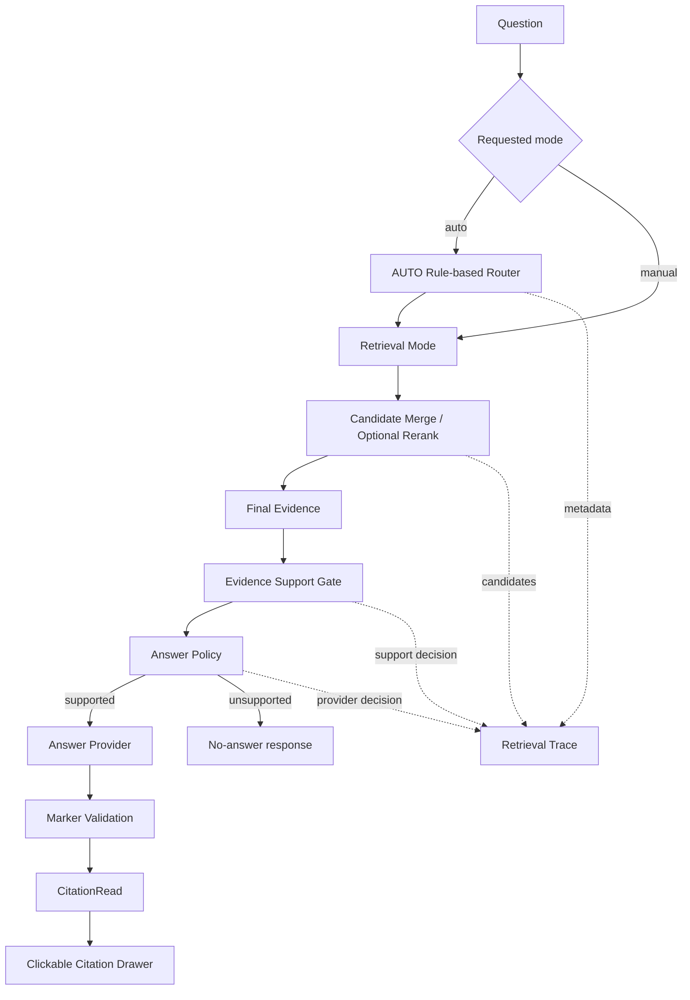

<div align="center">

# PureLink

PureLink is a local-first, self-hosted RAG knowledge workspace with structured document processing, routed retrieval, deterministic answer controls, traceable citations, and retrieval observability.

[](https://github.com/pmk915/purelink/actions/workflows/ci.yml)
[](https://github.com/pmk915/purelink/actions/workflows/smoke.yml)
[](LICENSE)
[](https://www.python.org/)
[](frontend/)
[](docker-compose.yml)

[Engineering highlights](#engineering-highlights) · [Evaluation](#evaluation-snapshot) · [Architecture](#architecture-and-request-flow) · [Code tour](#where-to-start) · [Quick start](#quick-start) · [Documentation](#documentation)

</div>

<p align="center">
  
</p>

PureLink is built for developers who want to inspect how a text-based RAG system processes documents, retrieves evidence, decides whether an answer is supportable, and maps provider output back to source locations. It combines personal and team knowledge workspaces with backend-generated citations, processing diagnostics, retrieval traces, and reproducible evaluation.

The project addresses a gap common in small RAG demos: retrieval and answer generation often work as an opaque request, while parser decisions, chunk boundaries, evidence sufficiency, citation provenance, and failure states remain hidden. PureLink keeps those boundaries explicit and testable. It is an engineering-oriented reference project, not a production-audited SaaS platform or a claim of state-of-the-art retrieval quality.

## Engineering Highlights

1. **[Structured document processing](docs/ingestion/file-processing-pipeline.md)** routes supported files through typed parsers, persists `DocumentBlock` records, and uses queued processing/indexing jobs with retry and failure states.
2. **[Block-aware chunking](docs/ingestion/document-blocks.md)** carries heading paths and source spans forward, keeps small tables and code blocks intact, and has bounded fallback behavior for oversized content.
3. **[Hybrid and routed retrieval](docs/rag/retrieval-layer.md)** provides vector, keyword, overview, and lightweight graph candidates behind one retrieval contract; `auto` uses a transparent rule-based query router.
4. **[Evidence Support Gate](docs/retrieval-and-citations.md)** evaluates whether final evidence covers the entity and requested intent before an answer provider is allowed to run, including deterministic no-answer control.
5. **[Deterministic Answer Policy](docs/rag/answer-policy.md)** aligns the provider call decision, evidence-only instructions, allowed markers, and post-generation marker validation. External knowledge is disabled for grounded answers.
6. **[Citation and retrieval observability](docs/rag/retrieval-trace.md)** connects persisted citation units to a clickable Citation Drawer, records candidate and policy decisions in Retrieval Trace, and exposes document processing readiness in the workspace.

## Evaluation Snapshot

The latest committed generalization baseline uses 50 deterministic cases over a small cross-domain corpus: 45 answerable questions and 5 no-answer questions. It does not use an LLM as judge.

| Metric | Result |
|---|---:|
| Cases | 50 |
| Retrieval hit | 42 / 45 |
| Citation hit | 42 / 45 |
| Expected evidence hit | 32 / 45 |
| Router accuracy | 50 / 50 |
| Answerability accuracy | 50 / 50 |
| No-answer cases | 5 / 5 |
| Trace available | 50 / 50 |

Source: [committed answer-policy baseline](tests/eval/baselines/answer-policy-auto-block-aware/summary.md). Metric definitions and reproduction details are in [RAG Evaluation](docs/rag/rag-evaluation.md).

This is a reproducible regression baseline, not a production-scale benchmark. The snapshot also records `forbidden_evidence_clean` at 7 / 9 and expected evidence at 32 / 45. Overview retrieval is the weakest category at 3 / 5 retrieval hits and 2 / 5 expected-evidence hits. These remaining precision and recall failures are kept visible in the committed report rather than removed from the corpus.

## Product Walkthrough

### Retrieval Trace and Routed Evidence

An `auto` technical query routes to keyword + vector hybrid retrieval with an explicit reason, trace id, reranker status, and scored source evidence. The current frontend exposes routing and candidate details; Evidence Support and Answer Policy decisions remain backend trace metadata rather than fields in this panel.



### Document Processing Inspector

The document-level inspector shows an indexed, RAG-ready document and the persisted blocks, chunks, citation units, vector index, and graph index checks used to diagnose readiness without reading worker logs.



### Graph Explorer

The lightweight Graph Explorer supports entity search and one-hop inspection. Relation sources retain the public document name, chunk and citation-unit references, and the grounded source snippet.



## Architecture and Request Flow

### System Context



### Document Processing



### Answer Flow



The detailed ingestion and retrieval diagrams live in [RAG Pipeline](docs/rag/rag-pipeline.md) and [RAG v2 Architecture](docs/architecture/rag-v2-architecture.md).

## Product Walkthrough

### Retrieval Trace and Routed Evidence

An `auto` technical query routes to keyword + vector hybrid retrieval with an explicit reason, trace id, reranker status, and scored source evidence. The current frontend exposes routing and candidate details; Evidence Support and Answer Policy decisions remain backend trace metadata rather than fields in this panel.


### Document Processing Inspector

The document-level inspector shows an indexed, RAG-ready document and the persisted blocks, chunks, citation units, vector index, and graph index checks used to diagnose readiness without reading worker logs.


### Graph Explorer

The lightweight Graph Explorer supports entity search and one-hop inspection. Relation sources retain the public document name, chunk and citation-unit references, and the grounded source snippet.


## Quick Start

Docker Compose is the primary local runtime. The default heuristic answer provider requires no external API key; FastEmbed downloads its model on first use and caches it under `./models`.

```bash
git clone https://github.com/pmk915/purelink.git
cd purelink
cp .env.example .env
docker compose up -d --build db redis api worker frontend
docker compose ps
```

Open:

- Web app: `http://localhost:3000`
- API: `http://localhost:8000`
- OpenAPI: `http://localhost:8000/docs`
- Health: `http://localhost:8000/api/v1/health`

Register a local user, create a personal knowledge base, upload a file from `sample_docs/`, wait for processing, and ask a question. Source citations, retrieval details, and document readiness are available from the workspace.

For provider settings and operational setup, use [.env.example](.env.example), [Model Providers](docs/rag/model-providers.md), [Docker Deployment](docs/development/docker-deployment.md), and [Troubleshooting](docs/troubleshooting.md).

## Where to Start

The full [PureLink Code Tour](docs/interview/code-tour.md) follows the request path with verified functions, tests, and design notes. The shortest reading path is:

| Area | Entry point |
|---|---|
| Document processing | [`app/services/document_processing.py`](app/services/document_processing.py) |
| Parser routing | [`app/services/document_parsing/parser_registry.py`](app/services/document_parsing/parser_registry.py) |
| Block-aware chunking | [`app/services/document_chunking/block_aware_chunker.py`](app/services/document_chunking/block_aware_chunker.py) |
| Retrieval orchestration | [`app/services/retrieval/retrieval_service.py`](app/services/retrieval/retrieval_service.py) |
| AUTO query router | [`app/services/retrieval/query_router.py`](app/services/retrieval/query_router.py) |
| QA orchestration | [`app/services/qa.py`](app/services/qa.py) |
| Answer Policy | [`app/services/answer_policy.py`](app/services/answer_policy.py) |
| Evaluation harness | [`scripts/eval/run_rag_generalization_eval.py`](scripts/eval/run_rag_generalization_eval.py) |

## Implemented Scope

- Personal and team knowledge bases with ownership, membership, and admin boundaries.
- `.txt`, `.md`, `.docx`, and text-based `.pdf` ingestion with processing diagnostics.
- Fixed and block-aware chunking, persisted citation units, vector index metadata, and lightweight graph data.
- `chunk_only`, `overview`, `hybrid_text`, `graph_vector_mix`, and rule-based `auto` retrieval modes.
- Evidence-gated Q&A, deterministic Answer Policy, clickable citations, Retrieval Trace, and eval tooling.

Hybrid retrieval, lightweight GraphRAG, the rule-based router, and optional rerankers remain experimental engineering surfaces. The graph layer uses PostgreSQL and local extraction rules; it is not a dedicated graph database or a complex multi-hop reasoning engine.

Current non-goals include OCR for scanned PDFs, audio/video transcription, general multimodal understanding, billing, enterprise administration, and direct public-internet production hardening.

## Reproduce and Verify

```bash
make test
cd frontend && npm run lint && npm run build
cd ..
make docs-check
make smoke
make eval-rag-generalization
```

The generalization runner creates a temporary local evaluation knowledge base and writes run artifacts under `data/eval_runs/`. See [Testing and Smoke](docs/development/testing-and-smoke.md) before running Docker or evaluation workflows.

## Documentation

The complete map is [docs/README.md](docs/README.md). Recommended entry points:

- [PureLink Code Tour](docs/interview/code-tour.md)
- [Project Storyline](docs/interview/project-storyline.md)
- [RAG Pipeline](docs/rag/rag-pipeline.md)
- [File Processing Pipeline](docs/ingestion/file-processing-pipeline.md)
- [Retrieval and Citations](docs/retrieval-and-citations.md)
- [Answer Policy](docs/rag/answer-policy.md)
- [RAG Evaluation](docs/rag/rag-evaluation.md)
- [Knowledge Base Workspace](docs/product/kb-workspace.md)

## Security and Deployment

The default stack is intended for local development and controlled self-hosting. Before broader exposure, replace development secrets and passwords, restrict CORS, use TLS and a reverse proxy, protect PostgreSQL and Redis from public access, and establish backup and upload-storage controls. See [SECURITY.md](SECURITY.md) and [Docker Deployment](docs/development/docker-deployment.md).

## Contributing

Focused bug reports, documentation fixes, tests, and narrow engineering proposals are welcome. See [CONTRIBUTING.md](CONTRIBUTING.md) for setup and pull request checks.

## License

[MIT](LICENSE)
