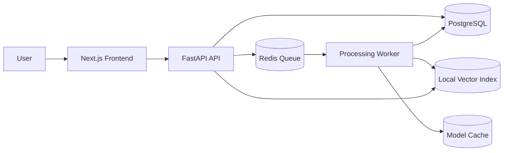
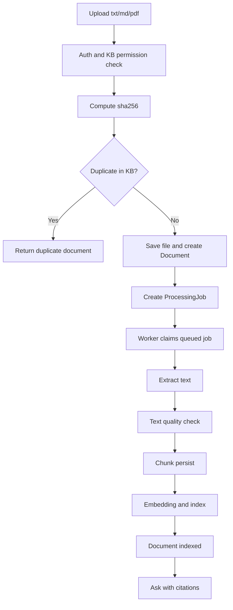
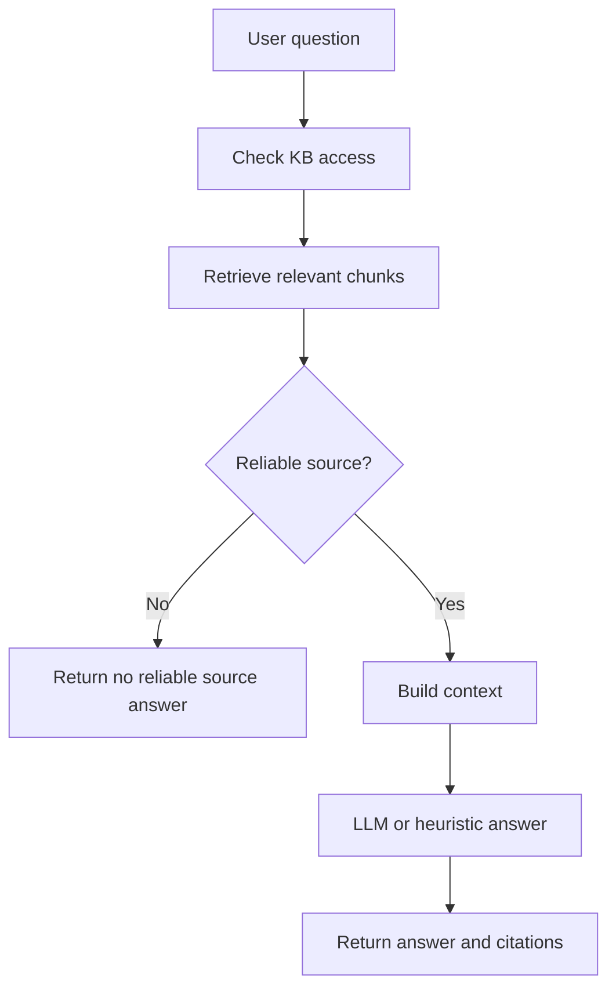

# PureLink


PureLink Core 是一个轻量级 local-first 文本知识库问答系统，专注 `txt` / `md` / 普通文本型 `pdf` 的上传、处理、语义检索和带来源问答。

它不是多模态助手、视频处理系统，也不是默认启用 OCR / ASR 的重型 RAG 平台。当前 `Core` 版本的边界很明确：围绕团队内部文本知识沉淀、检索、问答和来源追踪，把默认部署保持在轻量、稳定、可自部署的范围内。

PureLink is a local-first, cloud-ready, self-hosted AI knowledge workspace for text knowledge bases.

## What Is PureLink Core?

PureLink Core 面向这样的主路径：

```text
注册登录 -> 创建知识库 -> 上传 txt/md/pdf -> 自动处理 -> 建立索引 -> 提问 -> 查看 answer + citations
```

适合场景：

- 个人本机部署
- 小团队内网部署
- 实验室 / 项目组服务器
- 自己控制数据和模型配置的云服务器

## Current Features

- 用户注册 / 登录
- 个人知识库 / 团队知识库
- txt / md / 普通文本型 PDF 上传
- sha256 文件去重
- Redis + Worker 异步处理
- `ProcessingJob` 状态管理、retry、timeout、worker 抢占
- 文本清洗与质量检测
- 文档 chunk 化
- `fastembed` + `BAAI/bge-small-zh-v1.5` 本地语义检索
- knowledge base 级 `reindex`
- ask 问答
- citations 来源引用
- 轻量 Docker 本地部署

## Current Core Does Not Support

- 图片 OCR
- 扫描 PDF OCR
- 音频 / 视频 ASR
- 多模态图片 / 视频理解
- 默认 `PyTorch` / `sentence-transformers`
- MinIO / S3
- Go file service

这些能力可以进入 Roadmap，但不属于当前 `Core` 默认能力。如果上传不支持的文件，后端会返回 `UNSUPPORTED_FILE_TYPE` 或 `FEATURE_NOT_ENABLED`。

## Quick Start

### 环境要求

- Docker Desktop 或 Linux Docker Engine
- Docker Compose v2
- 建议 Python 3.12（本地跑测试时）
- 建议 Node.js 24 LTS（本地跑前端 lint/build 时）

### 启动服务

```bash
git clone https://github.com/pmk915/purelink.git
cd purelink
cp .env.example .env
docker compose up -d --build api worker frontend
make check
```

访问入口：

- Frontend: `http://localhost:3000`
- API: `http://localhost:8000/api/v1`
- Swagger: `http://localhost:8000/docs`
- Provider status: `http://localhost:8000/api/v1/system/providers`

默认不预置账号。启动后需要先注册，再创建知识库并上传文件。

### 最小演示流程

1. 打开 `http://localhost:3000`
2. 注册账号并登录
3. 创建个人知识库
4. 上传 `sample_docs/sample.txt`
5. 上传 `sample_docs/sample.md`
6. 也可以额外上传任意一个可复制文字的普通文本型 PDF
7. 等待文档状态变为“可问答”
8. 在问答区提问
9. 查看 answer 下方“参考来源”

`sample_docs/` 中的文件用于本地演示，不包含隐私内容。

## 配置说明

当前 `Core` 默认推荐配置：

```env
EMBEDDING_PROVIDER=fastembed
EMBEDDING_MODEL=BAAI/bge-small-zh-v1.5
EMBEDDING_MODEL_CACHE_DIR=/app/models/embedding
EMBEDDING_NORMALIZE=true

LLM_PROVIDER=heuristic

OCR_PROVIDER=disabled
ASR_PROVIDER=disabled
MULTIMODAL_PROVIDER=disabled

RETRIEVAL_MIN_SCORE=0.15
```

说明：

- `EMBEDDING_PROVIDER=fastembed` 是默认本地语义检索方案
- 默认模型为 `BAAI/bge-small-zh-v1.5`
- 模型缓存放在宿主机 `./models`，容器内挂载到 `/app/models`
- 模型权重不会提交到 Git，也不会被打进默认 Docker 镜像
- `LLM_PROVIDER=heuristic` 适合本地 demo；如需更强回答能力，可改为 `openai_compatible` 或 `deepseek`
- `OCR_PROVIDER`、`ASR_PROVIDER`、`MULTIMODAL_PROVIDER` 在 Core 中默认关闭
- `RETRIEVAL_MIN_SCORE` 用于控制“是否有足够可靠来源可以回答”

如果你不想下载任何 embedding 模型，可以切到：

```env
EMBEDDING_PROVIDER=local_hashed_bow
EMBEDDING_MODEL=
```

但检索质量会明显弱于真实语义 embedding。

## 接入大模型回答

如果你只是想接入一个现成的大模型 API，而不是改代码，当前最小路径是直接配置：

```env
LLM_PROVIDER=openai_compatible
LLM_API_BASE_URL=https://api.example.com/v1
LLM_API_KEY=your-api-key
LLM_MODEL=your-chat-model
LLM_TIMEOUT_SECONDS=30
```

然后重启 API / worker：

```bash
docker compose up -d --build api worker
```

### DeepSeek 配置示例

如果你要接 DeepSeek，当前支持直接使用：

```env
LLM_PROVIDER=deepseek
LLM_API_BASE_URL=https://api.deepseek.com
LLM_API_KEY=your-deepseek-api-key
# 或者直接使用 DEEPSEEK_API_KEY=your-deepseek-api-key
LLM_MODEL=deepseek-v4-pro
LLM_TIMEOUT_SECONDS=30
LLM_REASONING_EFFORT=high
LLM_THINKING_ENABLED=true
```

说明：

- `LLM_API_BASE_URL` 对 DeepSeek 应该写 `https://api.deepseek.com`
- `LLM_API_KEY` 和 `DEEPSEEK_API_KEY` 当前都可用，优先读取 `LLM_API_KEY`
- 当前后端会请求 `POST /chat/completions`
- `LLM_REASONING_EFFORT` 和 `LLM_THINKING_ENABLED` 会透传到 DeepSeek 请求体
- 如果你不需要 thinking 模式，可以把 `LLM_THINKING_ENABLED=false`

### 当前代码入口在哪里

如果你想看 PureLink 现在是在哪里接入大模型回答的，核心文件是：

- [app/services/qa.py](app/services/qa.py)
  - `answer_question()`：问答主入口
  - `resolve_answer_generator()`：根据 `LLM_PROVIDER` 选择回答实现
  - `OpenAICompatibleAnswerGenerator`：当前默认的外部大模型回答器
- [app/services/llm.py](app/services/llm.py)
  - `generate_openai_compatible_chat_completion()`：真正发起 HTTP 请求的地方
- [app/schemas/llm.py](app/schemas/llm.py)
  - `HEURISTIC_PROVIDER`
  - `OPENAI_COMPATIBLE_PROVIDER`
  - `DEEPSEEK_PROVIDER`
  - `SUPPORTED_LLM_PROVIDERS`
- [app/core/config.py](app/core/config.py)
  - 读取 `LLM_PROVIDER`、`LLM_API_BASE_URL`、`LLM_API_KEY`、`LLM_MODEL`
  - 读取 `LLM_REASONING_EFFORT`、`LLM_THINKING_ENABLED`

### 如果要新增一个新的 LLM provider，应该改哪里

建议按这条路径改：

1. 在 [app/schemas/llm.py](app/schemas/llm.py) 增加新的 provider 常量
2. 在 [app/core/config.py](app/core/config.py) 复用现有配置项，或补充新 provider 需要的配置
3. 在 [app/services/llm.py](app/services/llm.py) 新增对应的请求函数
4. 在 [app/services/qa.py](app/services/qa.py) 新增一个新的 `AnswerGenerator` 实现，并接到 `resolve_answer_generator()`

也就是说：

- **问答路由入口不需要改**
- **retrieval 和 citations 逻辑不需要改**
- 真正需要扩展的是 `qa.py` 里的回答器选择逻辑，以及 `llm.py` 里的 provider 调用实现

### 为什么入口放在这里

PureLink 当前把问答链路拆成两段：

- retrieval / citations：由后端自己控制，保证来源可靠
- answer generation：由 `LLM_PROVIDER` 决定

这样做的好处是，你可以替换回答模型，但不用动 citations 生成逻辑，也不会让大模型自己编来源。

## Citation 与可靠性策略

问答接口会直接返回结构化 `citations`，不是让大模型自己编造来源。

当前 Core 的 chunk metadata 规范：

- txt: `source_type=text`，`source_locator=text:chunk:<chunk_index>`
- markdown: `source_type=markdown`，`source_locator=heading:<heading>` 或 `markdown:chunk:<chunk_index>`
- pdf: `source_type=pdf`，`page_number=<n>`，`source_locator=page:<n>`

如果没有检索到结果，或者最高分低于 `RETRIEVAL_MIN_SCORE`，系统会返回：

```text
当前知识库中没有找到足够可靠的依据，无法确认该问题。
```

同时 `citations=[]`，避免无依据作答。

## 架构概览



系统组件说明：

- Frontend：登录、知识库管理、上传、问答、citation 展示
- API：鉴权、权限控制、上传入口、ask/reindex 接口
- PostgreSQL：业务主数据
- Redis：异步任务队列
- Worker：文档处理和索引
- Local Vector Index：本地索引产物
- Model Cache：`fastembed` 模型缓存

## 文件处理流程



这条链路强调两点：

- 上传接口只做轻量入口工作，不同步解析文件
- 文本质量不达标时，chunk 不会入库，避免脏数据污染索引

## 问答流程



## 项目设计取舍

当前版本不默认做多模态，原因很直接：

- 轻量开源项目不应该默认带上 OCR / ASR / 视频 / 多模态重依赖
- 当前核心业务是团队文本知识库，而不是通用多模态助手
- 语义检索是核心智能能力，先把文本处理、索引、问答和来源追踪做稳
- OCR、ASR、Go file service 等更适合作为未来扩展，而不是默认路径

## 支持的文件类型

| 类型 | 格式 | 说明 |
| --- | --- | --- |
| Text | `.txt`, `.md` | 推荐首次 demo 使用 |
| PDF | `.pdf` | 仅支持普通文本型 PDF |

## 相关文档

- [架构说明](docs/architecture.md)
- [处理流水线](docs/processing-pipeline.md)
- [任务状态机](docs/job-state-machine.md)
- [检索与 citations](docs/retrieval-and-citations.md)
- [本地演示指南](docs/demo-guide.md)
- [项目复盘 / 面试说明](docs/project-notes.md)
- [故障排查](docs/troubleshooting.md)

## Roadmap

### Short-term

- 继续优化 txt / md / 普通文本型 PDF 的处理稳定性
- 改善 fastembed 检索质量和 reindex 体验
- 完善 citation 展示和 source preview 体验
- 持续收紧默认部署边界

### Mid-term

- OCR extension
- media extension
- `sentence_transformers` advanced embedding
- 云服务器部署指南
- 更完整的管理员调试视图

### Long-term

- Go file service
- MinIO / S3
- pgvector / Qdrant / FAISS 可替换索引后端
- 更细粒度权限与审计

## 验证命令

```bash
python3 -m compileall app tests
PYTHONPATH=/home/pmk/projects/purelink ./.venv/bin/pytest -q
cd frontend && npm run lint
cd frontend && npm run build
bash -n scripts/check_stack.sh
docker compose --env-file .env.example config
docker compose up -d --build api worker frontend
make check
git diff --check
```

## License

[MIT](LICENSE)
