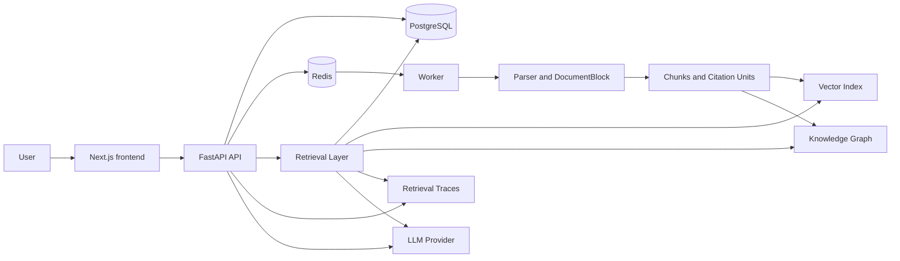

<div align="center">

# PureLink

PureLink is a self-hosted RAG knowledge workspace with traceable retrieval, grounded citations, and document-processing observability.

[](https://github.com/pmk915/purelink/actions/workflows/ci.yml)
[](https://github.com/pmk915/purelink/actions/workflows/smoke.yml)
[](LICENSE)
[](https://www.python.org/)
[](frontend/)
[](docker-compose.yml)

[Quick start](#quick-start) · [Features](#features) · [Architecture](#architecture) · [Documentation](#documentation) · [Contributing](#contributing)

</div>

## Overview

PureLink is a local-first, self-hosted knowledge workspace for building and inspecting text-based RAG systems. It supports personal and team knowledge bases, document upload and processing, semantic retrieval, citation-grounded Q&A, retrieval traces, and reproducible evaluation runs.

The project is designed for developers who want a practical RAG stack they can run, inspect, test, and adapt. It is not a complete production SaaS platform, and it does not try to replace a managed enterprise search product or a dedicated graph database.

## Why PureLink?

Many RAG demos hide the operational details that make a system trustworthy: which parser ran, how text was chunked, whether citations came from the retrieved context, why a query used one retrieval mode over another, and where document processing failed.

PureLink makes those surfaces visible:

- Documents move through an observable processing pipeline.
- Answers are grounded in citation units rather than unsupported model output.
- Retrieval traces expose mode selection, scores, context assembly, and evidence.
- RAG readiness can be checked from the UI without reading backend logs.
- Evaluation scripts compare retrieval behavior across chunking and retrieval modes.

## Features

### Stable Core

- Personal and team knowledge base workspaces.
- Authentication and permission boundaries for personal and team resources.
- Upload support for `.txt`, `.md`, `.docx`, and text-based `.pdf` files.
- Upload validation for size, extension, and MIME type.
- Redis-backed document processing jobs.
- Processing retry, failure details, and timeout handling.
- Parser routing and `DocumentBlock` persistence.
- Fixed and block-aware chunking.
- FastEmbed semantic embeddings.
- Citation-grounded Q&A.
- Document Processing Inspector for RAG readiness checks.
- Knowledge base health summary.
- Alembic database migrations.
- Docker Compose local deployment.
- Python, Go, frontend, smoke, E2E, and documentation checks.

### Experimental RAG Capabilities

These features are available for inspection and iteration, but the current eval baseline has not proved that they generally outperform `block_aware + chunk_only`:

- `hybrid_text` retrieval for keyword plus vector matching.
- `graph_vector_mix` retrieval for lightweight GraphRAG candidates plus vector search.
- `auto` retrieval mode with a rule-based query router.
- Lightweight PostgreSQL-backed GraphRAG data model and lifecycle cleanup.
- Graph Explorer for inspecting entities, relations, and sources.
- Optional rerankers.
- Retrieval trace inspection.

### Out of Scope

- OCR for scanned PDFs.
- Audio or video transcription.
- General multimodal understanding.
- Neo4j, Memgraph, or another dedicated graph database.
- Complex multi-hop graph reasoning.
- Billing, enterprise administration, and SaaS operations.
- Production hardening for direct public internet exposure.

## Quick Start

Docker is the primary way to run PureLink locally. You only need Docker Engine or Docker Desktop with Docker Compose v2.

Python, Node.js, and Go are only required when running host-side development checks outside Docker.

```bash
git clone https://github.com/pmk915/purelink.git
cd purelink
cp .env.example .env
docker compose up -d --build db redis api worker frontend
docker compose ps
```

Open:

- Web app: `http://localhost:3000`
- API: `http://localhost:8000`
- OpenAPI: `http://localhost:8000/docs`
- Health: `http://localhost:8000/api/v1/health`

The default configuration uses the heuristic LLM provider, so no external API key is required for a local text demo. FastEmbed downloads the embedding model on first use and caches model files under `./models`.

A minimal demo flow:

1. Register a local user.
2. Create a personal knowledge base.
3. Upload files from `sample_docs/` or your own text documents.
4. Wait for processing to finish.
5. Ask a question and inspect the cited sources.
6. Open the document status inspector from the document list.

Useful commands:

```bash
docker compose logs -f api worker frontend
docker compose restart api worker frontend
docker compose down
```

`docker compose down` keeps the PostgreSQL volume. `docker compose down -v` deletes the database volume and resets local data.

## Architecture



The backend is a FastAPI service with PostgreSQL for application state and Redis for processing jobs. The worker parses documents, persists document blocks, creates chunks and citation units, writes vector index metadata, and maintains the lightweight graph index. The frontend provides knowledge base management, document diagnostics, Q&A, retrieval details, and graph inspection.

## Retrieval Modes

Retrieval and answer generation are separate. Retrieval selects and ranks evidence; answer generation uses that evidence to produce a citation-grounded response. If retrieved evidence falls below `RETRIEVAL_MIN_SCORE`, the API returns an insufficient-evidence response instead of fabricating a citation.

| Mode | Status | Purpose |
|---|---|---|
| `chunk_only` | Stable | Semantic retrieval over indexed chunks and citation units. |
| `overview` | Stable | Broad document-level or knowledge-base overview retrieval. |
| `hybrid_text` | Experimental | Combines keyword-style text matching with vector retrieval. |
| `graph_vector_mix` | Experimental | Mixes lightweight graph candidates with vector retrieval. |
| `auto` | Experimental | Uses a transparent rule-based router to select a retrieval mode. |

## Configuration

Local defaults live in `.env.example`. The most commonly adjusted variables are:

| Variable | Default | Purpose |
|---|---|---|
| `EMBEDDING_PROVIDER` | `fastembed` | Embedding backend for local semantic retrieval. |
| `EMBEDDING_MODEL` | `BAAI/bge-small-zh-v1.5` | Default FastEmbed model. |
| `CHUNK_STRATEGY` | `fixed` | Document chunking strategy. |
| `LLM_PROVIDER` | `heuristic` | Default local answer provider for demos. |
| `RERANKER_ENABLED` | `false` | Enables optional reranking. |
| `RETRIEVAL_MIN_SCORE` | `0.15` | Minimum evidence score before answering. |
| `MAX_UPLOAD_SIZE_MB` | `25` | Maximum upload size per file. |
| `CORS_ORIGINS` | `http://localhost:3000,http://127.0.0.1:3000` | Allowed frontend origins. |
| `AUTH_SECRET_KEY` | `purelink-dev-secret-key-change-me` | Development signing key; replace outside local demo use. |

Example OpenAI-compatible provider configuration:

```env
LLM_PROVIDER=openai_compatible
LLM_API_BASE_URL=https://api.example.com/v1
LLM_API_KEY=replace-with-your-key
LLM_MODEL=example-chat-model
```

Do not commit real API keys, `.env`, database dumps, uploads, logs, vector indexes, or model caches.

## Testing

```bash
make test
cd frontend && npm run lint
cd frontend && npm run build
make docs-check
make smoke
make e2e
make eval-rag-baseline
make eval-rag-generalization
```

`make eval-rag-baseline` is a regression baseline over repository documentation. It is useful for comparing retrieval behavior across modes, but it is not a large statistical benchmark.
`make eval-rag-generalization` builds a temporary local eval KB from small cross-domain text documents and writes deterministic retrieval/evidence reports under `data/eval_runs/`.

## Project Structure

| Path | Purpose |
|---|---|
| `app/` | FastAPI app, API routes, schemas, services, models, configuration, and database wiring. |
| `frontend/` | Next.js web application. |
| `alembic/` | Database migrations. |
| `scripts/` | Smoke, E2E, documentation, and eval utilities. |
| `tests/` | Backend and integration tests. |
| `docs/` | Product, architecture, RAG, ingestion, development, and roadmap documentation. |
| `sample_docs/` | Small local documents for demo uploads. |
| `docker-compose.yml` | Local Compose stack. |
| `docker-compose.prod.yml` | Production-like single-host Compose override. |

## Documentation

The full documentation index is [docs/README.md](docs/README.md).

- [RAG v2 Architecture](docs/architecture/rag-v2-architecture.md)
- [File Processing Pipeline](docs/ingestion/file-processing-pipeline.md)
- [Document Blocks](docs/ingestion/document-blocks.md)
- [Retrieval Layer](docs/rag/retrieval-layer.md)
- [Retrieval and Citations](docs/retrieval-and-citations.md)
- [Lightweight GraphRAG](docs/rag/lightweight-graphrag.md)
- [RAG Evaluation](docs/rag/rag-evaluation.md)
- [KB Workspace](docs/product/kb-workspace.md)
- [Testing and Smoke](docs/development/testing-and-smoke.md)
- [Docker Deployment](docs/development/docker-deployment.md)

## Deployment Notes

The default Compose stack is suitable for local development and controlled self-hosted environments. Before exposing a deployment beyond your machine:

- Replace `AUTH_SECRET_KEY`.
- Replace the database password.
- Restrict `CORS_ORIGINS` to trusted frontend origins.
- Put TLS, host routing, and request limits behind a reverse proxy.
- Do not expose PostgreSQL or Redis directly to the public internet.
- Back up the database and vector store together.
- Review upload directory permissions and disk capacity.
- Configure external provider keys through environment variables, not committed files.

## Project Status and Roadmap

PureLink has a working local-first RAG core with document ingestion, retrieval, citations, diagnostics, and evaluation tooling. The experimental RAG features are intentionally visible and testable, but they should be treated as engineering surfaces rather than claims of state-of-the-art retrieval quality.

Near-term work focuses on improving reliability, documentation, evaluation coverage, and the boundaries between stable workspace features and experimental retrieval features.

## Contributing

Contributions are welcome when they are focused and testable. Good first contributions include bug reports, small documentation fixes, targeted tests, and narrow proposals that improve the local developer experience.

See [CONTRIBUTING.md](CONTRIBUTING.md) for setup notes, quality checks, and pull request guidance.

## License

[MIT](LICENSE)
