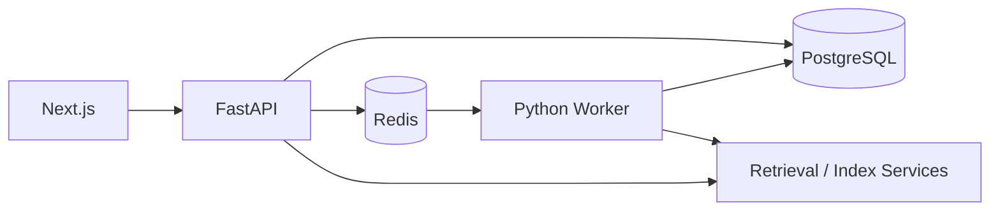
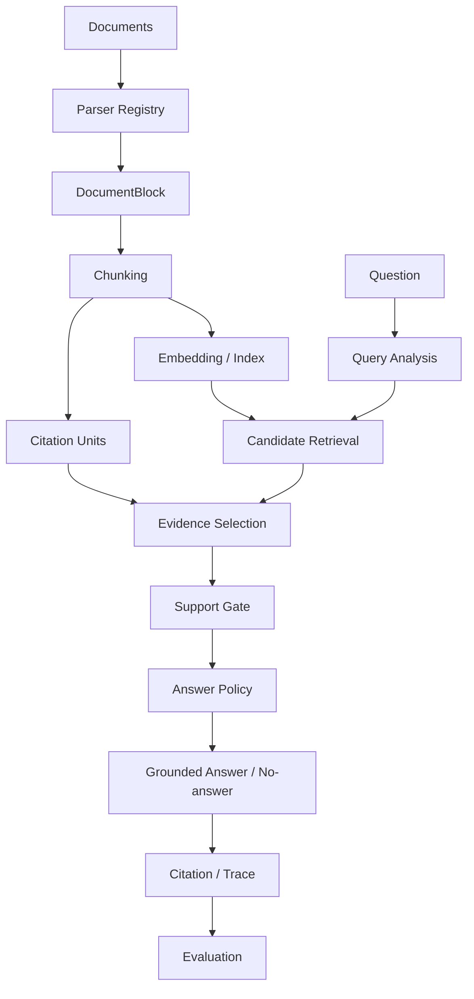

# PureLink

**A local-first, self-hosted RAG knowledge workspace focused on measurable retrieval, evidence selection, grounded citations, and reproducible evaluation.**

[English](README.md) | [简体中文](README.zh-CN.md)

[](https://github.com/pmk915/purelink/actions/workflows/ci.yml)
[](https://github.com/pmk915/purelink/actions/workflows/smoke.yml)
[](LICENSE)

**Measured results:** evidence precision **29.6% → 72.5%**; evidence recall **90% → 100%** on the internal 24-case format benchmark. Public Dense nDCG@10: **0.6226**, versus **0.6222** for the MTEB reference, on six NanoBEIR tasks. These are separate experiments.


## What PureLink Is

PureLink combines personal and team knowledge bases with a complete document-to-answer workflow. Upload TXT, Markdown, DOCX, or a native-text PDF, inspect its processing state, ask a question, and follow a citation back to the supporting source. The workspace exposes retrieval decisions and final evidence alongside the answer.

The project focuses on boundaries that make RAG understandable: parsing versus chunking, candidate retrieval versus evidence selection, and related text versus supported answers. A Python backend and worker own these decisions; the web interface makes their results inspectable. Local model and storage defaults support development and controlled self-hosting. The project is feature-frozen for portfolio presentation.

## Why PureLink

Finding the right document is only one stage of answering a question. A retrieved chunk can contain the desired fact together with old settings, unrelated table rows, or another entity's attributes. Passing all of that text to generation can produce a plausible answer with weak support.

PureLink makes those stages observable and measures them independently. Its internal format benchmark already had **100% document Recall@5**, while final-evidence precision was only **29.6%**. That finding directed the work toward evidence selection. A controlled change improved the selected evidence while preserving document ranking and the existing regression suite.

The public comparison supplied a second engineering lesson: the Dense path closely reproduced an independent MTEB reference, while the current Hybrid path reduced nDCG on every evaluated public task. Both the improvement and the negative result are retained with their experimental boundaries.

## Core Engineering Ideas

### 1. Structured Ingestion

```text
TXT / Markdown / DOCX / PDF → DocumentBlock → Chunk → Citation Unit
```

The parser registry returns a shared `ParsedDocument` contract, and ordered `DocumentBlock` records retain the structure each parser can recover. Chunking then operates through the existing fixed or block-aware strategy. Fixed chunking remains the Demo default; internal experiments explicitly use block-aware chunking.

**Chunks are retrieval/context units. Citation units are smaller evidence units with source provenance.** This distinction lets retrieval gather useful context while the answer references a narrower supporting statement. Citation units preserve processed-text ranges and available section/page information.

Native PDF extraction uses PyMuPDF page-aware text blocks, physical one-based page numbers, and block bounding boxes. Source spans preserve accurate citation pages even when a block-aware chunk spans multiple pages. This is deliberately lightweight extraction; its layout and OCR limits are documented below.

### 2. Retrieval Engineering

PureLink exposes dense/vector candidates, keyword candidates, Hybrid retrieval, overview retrieval, and lightweight graph candidates. The rule-based AUTO router selects among `chunk_only`, `hybrid_text`, `overview`, and `graph_vector_mix`, recording its reason and any effective fallback.

The lexical channel handles technical identifiers such as config keys, API paths, and commands through a local deterministic scorer. The graph channel stores source-grounded entities and one-hop relations in PostgreSQL. These strategies reuse the current service boundaries and local indexes.

Multiple strategies are traced and evaluated because their usefulness depends on the workload. The public experiment held the English embedding model and document representation fixed when comparing Dense with production Hybrid; it did not tune fusion weights to improve the scores.

### 3. Evidence Grounding

```text
Candidate Retrieval → Evidence Selection → Evidence Support Gate
  → Answer Policy → Grounded Answer → Citation
```

**Retrieved candidates ≠ final evidence ≠ a supported answer.** Selection chooses citation units from retrieved context. The support gate checks whether that evidence contains the requested fact. Answer Policy determines whether generation may proceed; unsupported questions skip the provider and return a no-answer response without citations.

Citation identities originate in backend evidence. The provider receives an allowed marker set, and returned markers are validated before citations reach the UI. This protects source identity and provenance, while the heuristic support gate still has explicit limits.

Retrieval Trace records requested/selected/effective modes, router reasons, candidate scores, selected evidence, filtering, and support/policy decisions. The Document Processing Inspector reports blocks, chunks, citation units, indexing, and readiness so failures can be investigated from the workspace.

### 4. Evaluation-driven Engineering

The repository contains a 50-case deterministic regression, a separate 24-case multi-format benchmark, a controlled M2 → M3 evidence-selection ablation, and public six-task NanoBEIR validation. Each answers a different question. Expected-document and evidence-phrase metrics diagnose internal behavior; official relevance judgments provide the external retrieval reference.

Experiments preserve configuration, failed cases, and denominators. No LLM judge or combined “PureLink score” joins these measurements. Detailed methodology and artifacts are linked from the evaluation section.

## Architecture and Request Flow

The product stack uses Next.js, FastAPI, PostgreSQL, Redis, and a Python processing worker. Uploads create processing jobs; parsing and indexing run asynchronously, while retrieval and QA read persisted document state and local index artifacts.


```mermaid
flowchart LR
    Web[Next.js] --> API[FastAPI]
    API --> DB[(PostgreSQL)]
    API --> Redis[(Redis)]
    Redis --> Worker[Python Worker]
    Worker --> DB
    Worker --> Index[Retrieval / Index Services]
    API --> Index
```


```mermaid
flowchart TD
    Docs[Documents] --> Parser[Parser Registry]
    Parser --> Blocks[DocumentBlock]
    Blocks --> Chunks[Chunking]
    Chunks --> Units[Citation Units]
    Chunks --> Index[Embedding / Index]
    Query[Question] --> Analysis[Query Analysis]
    Analysis --> Retrieve[Candidate Retrieval]
    Index --> Retrieve
    Units --> Select[Evidence Selection]
    Retrieve --> Select
    Select --> Gate[Support Gate]
    Gate --> Policy[Answer Policy]
    Policy --> Answer[Grounded Answer / No-answer]
    Answer --> Trace[Citation / Trace]
    Trace --> Eval[Evaluation]
```

`worker-go` is experimental, has different capabilities, and is not the default Compose worker. Detailed boundaries live in the [RAG architecture](docs/architecture/rag-v2-architecture.md) and the verified [Code Tour](docs/interview/code-tour.md).

## Evaluation

### A. Internal Regression

The 50-case suite contains **44 answerable and 6 no-answer cases** over a small cross-domain corpus. It uses block-aware chunking, `local_hashed_bow / hashed_bow_v1`, AUTO routing, and disabled/noop reranking for repeatability.

| Metric | Result |
|---|---:|
| Retrieval hit / citation hit | 43/44 / 43/44 |
| Expected evidence hit | 39/44 |
| Answerability | 49/50 |
| No-answer correctness | 6/6 |

This is a deterministic engineering regression suite. The [final sanitized capture](tests/eval/baselines/portfolio-final-auto-block-aware/summary.md), preserved [historical baseline](tests/eval/baselines/answer-policy-auto-block-aware/summary.md), and [metric definitions](docs/rag/rag-evaluation.md) expose remaining failures. The normal Demo uses fixed chunking and Chinese FastEmbed, so its runtime results are documented separately from this fixture configuration.

### B. Evidence Selection Ablation

The multi-format slice has **24 cases**, six each for TXT, Markdown, DOCX, and PDF: 20 answerable cases and four no-answer cases. It includes outdated distractor documents and two physical PDF page-2 citation checks.

| Metric | M2 baseline | M3 retained change |
|---|---:|---:|
| Document Recall@5 | 100% | 100% |
| Document MRR | .925 | .925 |
| Expected evidence hit | 18/20 | 20/20 |
| Evidence recall | 90% | 100% |
| Evidence precision | 29.6% | 72.5% |
| Answerability | 20/24 | 24/24 |
| No-answer correctness | 4/4 | 4/4 |

The retained change combines incremental query-term coverage in generic selection with a shared responsibility-matching correction. Corpus, ranked documents, embedding, chunk strategy, and Answer Policy were held fixed. The original 50-case suite remained unchanged.

A **coverage-only** variant reported 78.1% precision on 16 applicable cases but reduced evidence recall to **80%**. It was rejected. Unknown evidence is excluded from the precision formula, so precision must be read with its denominator and recall. Seven format cases still contain forbidden evidence, including archive facts and inseparable table rows. These are phrase-based engineering measurements, not semantic answer accuracy. See the [controlled ablation](docs/rag/evidence-selection-ablation.md) and [final format capture](tests/eval/baselines/portfolio-final-format-auto-block-aware/summary.md).

### C. Public Retrieval Validation

**Six-task partial NanoBEIR external validation**, with **300 queries**: NanoArguAna, NanoClimateFever, NanoDBPedia, NanoFEVER, NanoFiQA2018, and NanoHotpotQA, taken in MTEB's predefined order. The remaining seven tasks were explicitly unrun because of the runtime limit.

All configurations use `BAAI/bge-small-en-v1.5`, FastEmbed quantized ONNX, 384 dimensions, normalized embeddings, CPU, top-k=10, and disabled reranking. Official title/text representation and qrels are shared. The independent direct encoder lets official MTEB perform reference search/scoring; the adapter exercises PureLink's production retrieval functions.

| Pipeline | nDCG@10 | Recall@10 | MRR@10 |
|---|---:|---:|---:|
| MTEB Dense reference | .6222 | .6710 | .6821 |
| PureLink Dense | .6226 | .6710 | .6826 |
| PureLink Hybrid | .5569 | .6340 | .6055 |

Dense passes the reference checks on all six tasks, providing an external sanity check of encoding, indexing, similarity, and ranking. **Hybrid underperforms Dense in nDCG@10 on all six**, although some secondary metrics improve on individual tasks. Lexical fusion is workload-dependent; the measured negative result is preserved without tuning these tasks. This local validation establishes neither an official MTEB leaderboard rank nor results for the full NanoBEIR suite.

[Per-task scores, versions, limitations, and reproduction](docs/rag/rag-evaluation.md#public-retrieval-validation) remain separate from the internal evidence experiments. Optional benchmark dependencies stay outside the production Docker runtime.

## Demo

The [3–5 minute Demo Guide](docs/interview/purelink-demo-guide.md) uses an existing generated two-page PDF. Prepare the stack and model before presenting, upload the PDF to a fresh personal KB, wait for readiness, and ask about audit retention. Show the supported answer, open its citation, inspect the physical page-2 source, and then show selected evidence and retrieval trace. Finish with the three evaluation stories above.

Graph Explorer, team approval, manual modes, and reranker configuration are optional follow-ups. Additional UI views: [Retrieval Trace](docs/assets/screenshots/retrieval-trace.png) and [Processing Inspector](docs/assets/screenshots/processing-inspector.png).

## Quick Start

Use Docker Engine with Compose v2 or later, or Docker Desktop with integration enabled for your WSL distribution. Docker Compose is the primary runtime path.

```bash
git clone https://github.com/pmk915/purelink.git
cd purelink
cp .env.example .env
docker compose up -d --build db redis api worker frontend
docker compose ps
```

Wait for PostgreSQL, Redis, API, and frontend health checks; the Python worker should be running. Then open:

| Service | URL |
|---|---|
| Web | http://localhost:3000 |
| API | http://localhost:8000 |
| OpenAPI | http://localhost:8000/docs |
| Health | http://localhost:8000/api/v1/health |

Register/sign in, create a personal knowledge base, and upload a document. Simple files live in [sample_docs](sample_docs/README.md); the Demo Guide prepares the multi-page PDF from existing fixtures.

The default heuristic answer provider requires no external API key. Chinese FastEmbed (`BAAI/bge-small-zh-v1.5`) downloads its model on first use, storing it in `/app/models/embedding`, backed by `./models/embedding` on the host. Allow download/indexing time before a live demo. After the M4 provider semantics correction, **fully rebuild existing FastEmbed indexes**; model identity alone does not detect vectors created with the old generic prefixes.

For local development, use Python 3.12 and Node 24; [development commands](docs/development/dev-commands.md) cover installation. Verification entry points are `make test`, frontend `npm run lint` / `npm run build`, `make docs-check`, and `make KEEP_STACK_UP=1 smoke`. Evaluation reproduction is documented under [Testing and Smoke](docs/development/testing-and-smoke.md).

## Implemented Scope

- Authentication; personal KB ownership; team membership, admin boundaries, upload review, and conversations.
- TXT/Markdown/DOCX/native-text PDF ingestion; asynchronous jobs, processing diagnostics, and retry/reprocessing.
- Fixed and block-aware chunks, persisted citation units, local vector artifacts with compatibility metadata, and lightweight source-grounded graph data.
- Dense, lexical, Hybrid, overview, and graph/vector candidate paths; explainable rule-based AUTO routing.
- Evidence selection, support checks, Answer Policy, validated citations, retrieval traces, and deterministic/external evaluation tooling.

These features form one inspectable workspace; their existence does not imply enterprise deployment validation or equal quality across retrieval modes.

## Known Limitations

The internal datasets are small and deterministic. Phrase metrics approximate evidence quality, and the six public tasks provide a limited retrieval reference. The AUTO router's large-benchmark generalization is unproven. Reranking is optional and has no central demonstrated result here.

Evidence selection remains heuristic: outdated facts, cross-document noise, and multiple table rows can survive selection. Support checks and marker validation preserve explicit boundaries, but do not prove semantic entailment or eliminate all incorrect answers.

PDF extraction preserves page-aware blocks, bbox metadata, and citation provenance. Multi-column reading order is not guaranteed; there is no advanced heading inference or dedicated table-structure model. OCR is optional and disabled by default; mixed native/scanned completeness is limited. Audio/video and general multimodal understanding are outside this Demo.

There is no enterprise security audit or production-scale load benchmark. See [focused limitations](docs/interview/limitations.md) for the engineering trade-offs.

## Documentation

Start with the [documentation index](docs/README.md), then choose:

- [Project Storyline](docs/interview/project-storyline.md): a five-minute explanation built around hypotheses and measurements.
- [Code Tour](docs/interview/code-tour.md): upload → parse → chunk → index → evidence → answer → evaluation.
- [Demo Guide](docs/interview/purelink-demo-guide.md): stable commands, PDF, questions, and fallback checks.
- [RAG Evaluation](docs/rag/rag-evaluation.md) and [Evidence Ablation](docs/rag/evidence-selection-ablation.md): definitions, results, and reproducibility.
- [File Processing](docs/ingestion/file-processing-pipeline.md), [Answer Policy](docs/rag/answer-policy.md), and [Retrieval Trace](docs/rag/retrieval-trace.md): implementation boundaries.
- [Portfolio Verification](docs/development/portfolio-verification.md): actual final commands and results.

Focused bug reports, documentation fixes, and tests are welcome under [CONTRIBUTING.md](CONTRIBUTING.md). Feature development is frozen for this portfolio closeout.

## Security and Deployment Boundary

The default stack targets local development and controlled self-hosting. Authentication and ownership/membership checks are implemented, but public deployment still requires environment-specific security work. Replace development credentials, configure CORS, use TLS and a reverse proxy, isolate database/cache access, and establish backups and upload-storage controls. Review [SECURITY.md](SECURITY.md) and [Docker Deployment](docs/development/docker-deployment.md) before exposing the stack.

Provider choices can send text to external services when configured; local defaults and optional integrations should be understood separately. No enterprise SaaS maturity, security-audit, or production-capacity claim is made.

The final frontend `npm audit` reported 17 advisories: 2 moderate, 14 high, and 1 critical. Suggested fixes include a major Next.js upgrade, which was not applied during this feature freeze. Passing build and smoke checks does not clear these advisories; resolve dependency security findings before public deployment.

## License

[MIT](LICENSE).
