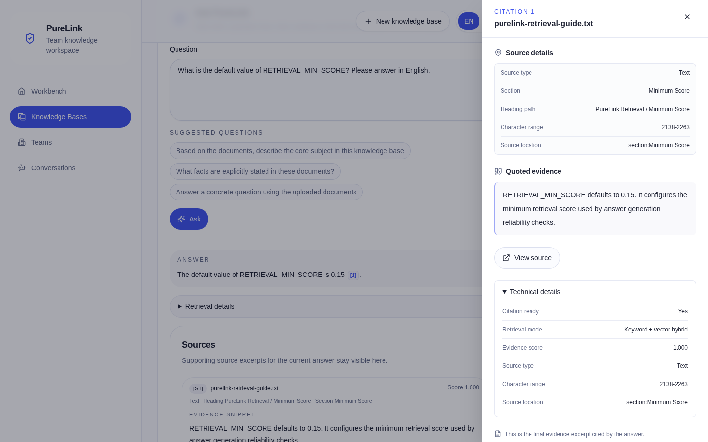
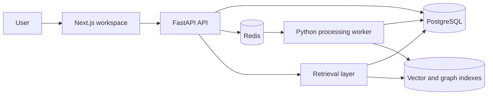
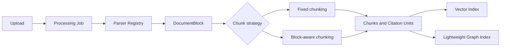
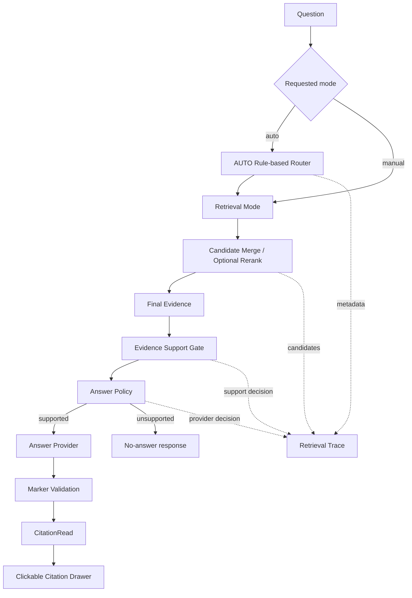
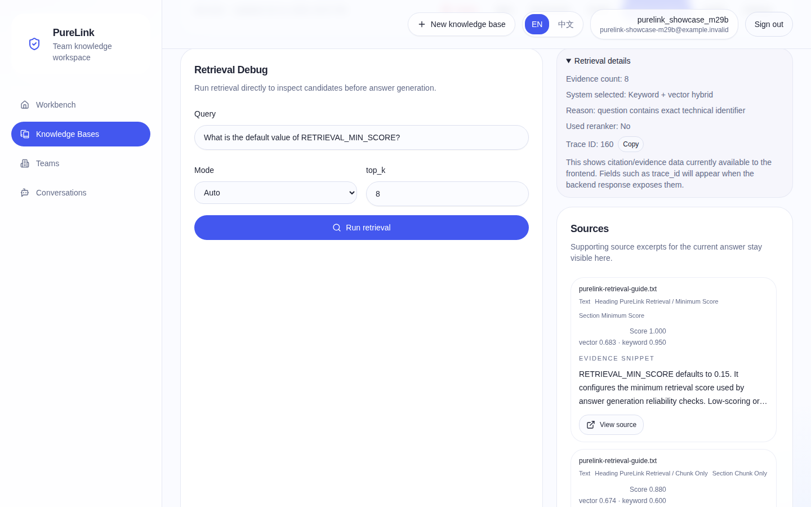
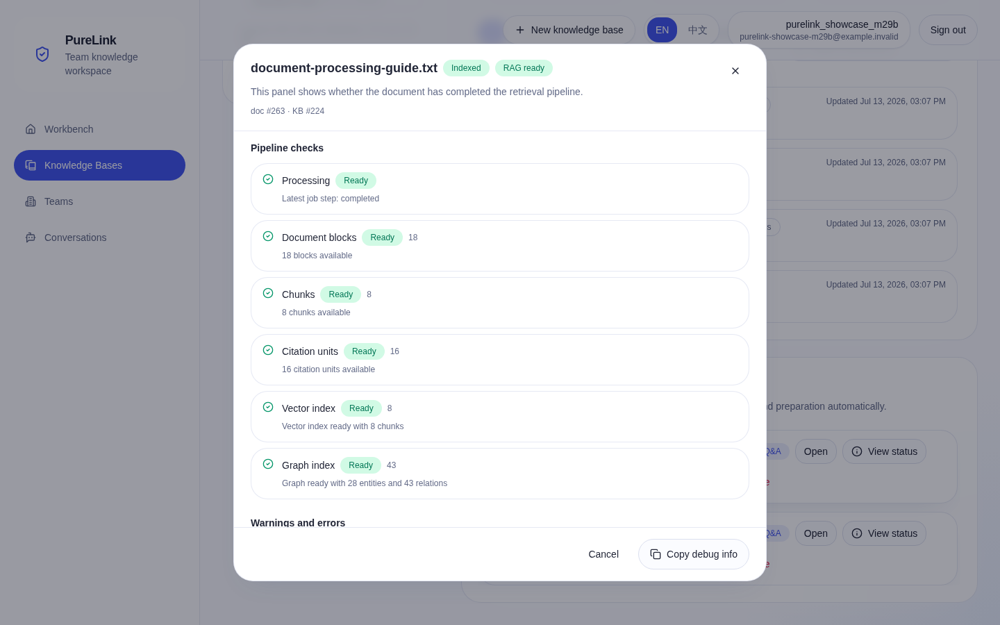

<div align="center">

# PureLink

PureLink is a local-first, self-hosted RAG knowledge workspace with structured document processing, routed retrieval, deterministic answer controls, traceable citations, and retrieval observability.

[](https://github.com/pmk915/purelink/actions/workflows/ci.yml)
[](https://github.com/pmk915/purelink/actions/workflows/smoke.yml)
[](LICENSE)
[](https://www.python.org/)
[](frontend/)
[](docker-compose.yml)

[Core decisions](#core-engineering-decisions) · [Evaluation](#evaluation-snapshot) · [Architecture](#architecture-and-request-flow) · [Demo](#product-walkthrough) · [Quick start](#quick-start) · [Documentation](#documentation)

</div>

<p align="center">
  
</p>

PureLink is an engineering-focused RAG knowledge workspace that makes document processing, retrieval decisions, evidence sufficiency, citations, and failure states explicit, observable, and testable. It combines personal and team workspaces with backend-grounded citations, processing diagnostics, retrieval traces, and reproducible evaluation.

## Problem

Small RAG demos commonly flatten document structure, hide retrieval strategy, treat retrieved relevance as answerability, delegate citation markers to the model, require logs to diagnose failures, and evaluate quality changes only by anecdote. PureLink keeps those boundaries explicit. It is an engineering reference project, not a production-audited SaaS platform or a claim of state-of-the-art retrieval quality.

## Core Engineering Decisions

1. **[Structured ingestion](docs/ingestion/file-processing-pipeline.md)** persists parser-neutral `DocumentBlock` records so PDF, DOCX, Markdown, and text parsing can evolve separately from chunking. The trade-off is more persisted state and processing work.
2. **[Chunk and citation-unit dual granularity](docs/ingestion/document-blocks.md)** uses chunks for retrieval context and smaller source-located units for claims and citations. Block-aware chunking is available for regression experiments; the default runtime remains fixed chunking.
3. **[Hybrid and routed retrieval](docs/rag/retrieval-layer.md)** provides vector, keyword, overview, and lightweight graph candidates behind one retrieval contract; `auto` uses a transparent rule-based query router.
4. **[Evidence Support and Answer Policy](docs/rag/answer-policy.md)** check question-specific support before generation, conservatively narrow explicit attribute/technical/relation evidence, and skip the provider for unsupported questions.
5. **[Backend-grounded citations](docs/retrieval-and-citations.md)** assign citation identities before generation, restrict allowed markers, validate provider output, and resolve the final drawer from backend evidence.
6. **[Trace and deterministic evaluation](docs/rag/retrieval-trace.md)** expose routing, candidates, final evidence, support/policy decisions, processing readiness, and repeatable phrase/document metrics.

## Evaluation Snapshot

### Deterministic Regression Baseline

The only current official interview regression suite is the 50-case generalization evaluation over a small cross-domain corpus: 44 answerable questions and 6 no-answer questions. It does not use an LLM as judge.

The committed run uses a deliberately reproducible configuration rather than the default Docker model stack:

```env
CHUNK_STRATEGY=block_aware
EMBEDDING_PROVIDER=local_hashed_bow
EMBEDDING_MODEL=hashed_bow_v1
RERANKER_ENABLED=false
RERANKER_PROVIDER=noop
```

| Metric | Result |
|---|---:|
| Cases | 50 |
| Retrieval hit | 43 / 44 |
| Citation hit | 43 / 44 |
| Expected evidence hit | 39 / 44 |
| Router accuracy | 50 / 50 |
| Answerability accuracy | 49 / 50 |
| Forbidden evidence clean | 9 / 9 |
| Mean evidence precision | 72.3% (42 applicable cases) |
| No-answer cases | 6 / 6 |
| Trace available | 50 / 50 |

Source: [committed answer-policy baseline](tests/eval/baselines/answer-policy-auto-block-aware/summary.md). Metric definitions and reproduction details are in [RAG Evaluation](docs/rag/rag-evaluation.md).

This baseline answers “did a system change cause a regression?” It emphasizes repeatability for CI and local checks; it is not a production-scale benchmark or the default Docker model stack. Remaining failures stay visible in the committed report.

### Format Coverage Benchmark

`make eval-rag-format` runs a separate 24-case deterministic engineering benchmark: six questions each for TXT, Markdown, DOCX, and PDF, including two PDF page-2 citation checks. It reuses the existing temporary-KB ingestion, indexing, retrieval, and QA runner. Reports add document Recall@1/@3/@5, document MRR, final-evidence recall, and per-format metrics while preserving the official regression and holdout suites. See the [M2 measured baseline](docs/rag/format-benchmark-baseline.md) and [metric definitions](docs/rag/rag-evaluation.md). This slice measures current behavior; it does not tune retrieval or QA.

### Default Runtime Evaluation

The default local Docker path follows [`.env.example`](.env.example):

```env
CHUNK_STRATEGY=fixed
EMBEDDING_PROVIDER=fastembed
EMBEDDING_MODEL=BAAI/bge-small-zh-v1.5
RERANKER_ENABLED=false
RERANKER_PROVIDER=noop
```

The same 50 cases were also run through the normal user-facing local stack without changing its defaults:

| Metric | Result |
|---|---:|
| Retrieval hit | 44 / 44 |
| Citation hit | 44 / 44 |
| Expected evidence hit | 36 / 44 |
| Router accuracy | 50 / 50 |
| Answerability accuracy | 47 / 50 |
| Forbidden evidence clean | 8 / 9 |
| Mean evidence precision | 70.6% (41 applicable cases) |
| Trace available | 50 / 50 |

Source: [committed default-runtime snapshot](tests/eval/baselines/runtime-fastembed-fixed/summary.md). This run answers “how does the actual Demo default perform?” It is reported separately from the deterministic regression baseline; neither configuration is presented as universally superior. Latency is local in-process timing and excludes ingestion, HTTP, LLM generation, and frontend rendering.

## Architecture and Request Flow

### System Context


```mermaid
flowchart LR
    User[User] --> Web[Next.js workspace]
    Web --> API[FastAPI API]
    API --> DB[(PostgreSQL)]
    API --> Redis[(Redis)]
    Redis --> Worker[Python processing worker]
    Worker --> DB
    API --> Retrieval[Retrieval layer]
    Retrieval --> DB
    Retrieval --> Index[(Vector and graph indexes)]
    Worker --> Index
```

### Document Processing


```mermaid
flowchart LR
    Upload[Upload] --> Job[Processing Job]
    Job --> Parser[Parser Registry]
    Parser --> Blocks[DocumentBlock]
    Blocks --> Strategy{Chunk strategy}
    Strategy --> Fixed[Fixed chunking]
    Strategy --> Aware[Block-aware chunking]
    Fixed --> Units[Chunks and Citation Units]
    Aware --> Units
    Units --> Vector[Vector Index]
    Units --> Graph[Lightweight Graph Index]
```

### Answer Flow


```mermaid
flowchart TD
    Question[Question] --> Requested{Requested mode}
    Requested -->|auto| Router[AUTO Rule-based Router]
    Requested -->|manual| Mode[Retrieval Mode]
    Router --> Mode
    Mode --> Candidates[Candidate Merge / Optional Rerank]
    Candidates --> Evidence[Final Evidence]
    Evidence --> Gate[Evidence Support Gate]
    Gate --> Policy[Answer Policy]
    Policy -->|supported| Provider[Answer Provider]
    Policy -->|unsupported| Refusal[No-answer response]
    Provider --> Validation[Marker Validation]
    Validation --> Citation[CitationRead]
    Citation --> Drawer[Clickable Citation Drawer]
    Router -. metadata .-> Trace[Retrieval Trace]
    Candidates -. candidates .-> Trace
    Gate -. support decision .-> Trace
    Policy -. provider decision .-> Trace
```

The detailed ingestion and retrieval diagrams live in [RAG Pipeline](docs/rag/rag-pipeline.md) and [RAG v2 Architecture](docs/architecture/rag-v2-architecture.md).

Docker Compose runs the Python worker entry point at [`app/workers/processing_worker_main.py`](app/workers/processing_worker_main.py). The separate [`worker-go`](worker-go/) implementation is experimental and is not feature-equivalent to, or used by, the default Compose stack. See [Docker Deployment](docs/development/docker-deployment.md#python-and-go-worker-positioning).

## Product Walkthrough

### Retrieval Trace and Routed Evidence

An `auto` technical query routes to keyword + vector hybrid retrieval with an explicit reason, trace id, reranker status, and scored source evidence. Evidence Support and Answer Policy decisions are stored in backend trace metadata.



### Document Processing Inspector

The document-level inspector shows an indexed, RAG-ready document and the persisted blocks, chunks, citation units, vector index, and graph index checks used to diagnose readiness without reading worker logs.



The [5-minute Demo Guide](docs/interview/purelink-demo-guide.md) keeps Graph Explorer, team KBs, processing jobs, manual modes, and rerankers as optional follow-ups rather than main-flow steps.

## Quick Start

Docker Compose is the primary local runtime. The default heuristic answer provider requires no external API key; FastEmbed downloads its model on first use and caches it under `./models`.

```bash
git clone https://github.com/pmk915/purelink.git
cd purelink
cp .env.example .env
docker compose up -d --build db redis api worker frontend
docker compose ps
```

Open:

- Web app: `http://localhost:3000`
- API: `http://localhost:8000`
- OpenAPI: `http://localhost:8000/docs`
- Health: `http://localhost:8000/api/v1/health`

Register a local user, create a personal knowledge base, upload a file from `sample_docs/`, wait for processing, and ask a question. Source citations, retrieval details, and document readiness are available from the workspace.

For provider settings and operational setup, use [.env.example](.env.example), [Model Providers](docs/rag/model-providers.md), [Docker Deployment](docs/development/docker-deployment.md), and [Troubleshooting](docs/troubleshooting.md).

## Where to Start

The full [PureLink Code Tour](docs/interview/code-tour.md) follows the request path with verified functions, tests, and design notes. The shortest reading path is:

| Area | Entry point |
|---|---|
| Document processing | [`app/services/document_processing.py`](app/services/document_processing.py) |
| Parser routing | [`app/services/document_parsing/parser_registry.py`](app/services/document_parsing/parser_registry.py) |
| Block-aware chunking | [`app/services/document_chunking/block_aware_chunker.py`](app/services/document_chunking/block_aware_chunker.py) |
| Retrieval orchestration | [`app/services/retrieval/retrieval_service.py`](app/services/retrieval/retrieval_service.py) |
| AUTO query router | [`app/services/retrieval/query_router.py`](app/services/retrieval/query_router.py) |
| QA orchestration | [`app/services/qa.py`](app/services/qa.py) |
| Answer Policy | [`app/services/answer_policy.py`](app/services/answer_policy.py) |
| Evaluation harness | [`scripts/eval/run_rag_generalization_eval.py`](scripts/eval/run_rag_generalization_eval.py) |

## Implemented Scope

- Personal and team knowledge bases with ownership, membership, and admin boundaries.
- `.txt`, `.md`, `.docx`, and text-based `.pdf` ingestion with processing diagnostics.
- Native PDF text uses PyMuPDF page-aware blocks with block-level bounding boxes and physical page provenance; [PDF limitations](docs/ingestion/file-processing-pipeline.md#native-pdf-extraction) remain explicit.
- Fixed and block-aware chunking, persisted citation units, vector index metadata, and lightweight graph data.
- `chunk_only`, `overview`, `hybrid_text`, `graph_vector_mix`, and rule-based `auto` retrieval modes.
- Evidence-gated Q&A, deterministic Answer Policy, clickable citations, Retrieval Trace, and eval tooling.

Hybrid retrieval, lightweight GraphRAG, the rule-based router, and optional rerankers remain experimental engineering surfaces. The graph layer uses PostgreSQL and local extraction rules; it is not a dedicated graph database or a complex multi-hop reasoning engine.

Current non-goals include OCR for scanned PDFs, audio/video transcription, general multimodal understanding, billing, enterprise administration, and direct public-internet production hardening.

## Reproduce and Verify

```bash
make test
cd frontend && npm run lint && npm run build
cd ..
make docs-check
make smoke
make eval-rag-generalization
```

The generalization runner creates a temporary local evaluation knowledge base and writes run artifacts under `data/eval_runs/`. See [Testing and Smoke](docs/development/testing-and-smoke.md) before running Docker or evaluation workflows.

## Documentation

The complete map is [docs/README.md](docs/README.md). Recommended entry points:

- [PureLink Code Tour](docs/interview/code-tour.md)
- [Technical Deep Dives](docs/interview/deep-dives/README.md)
- [Project Storyline](docs/interview/project-storyline.md)
- [RAG Pipeline](docs/rag/rag-pipeline.md)
- [File Processing Pipeline](docs/ingestion/file-processing-pipeline.md)
- [Retrieval and Citations](docs/retrieval-and-citations.md)
- [Answer Policy](docs/rag/answer-policy.md)
- [RAG Evaluation](docs/rag/rag-evaluation.md)
- [Knowledge Base Workspace](docs/product/kb-workspace.md)

## Security and Deployment

The default stack is intended for local development and controlled self-hosting. Before broader exposure, replace development secrets and passwords, restrict CORS, use TLS and a reverse proxy, protect PostgreSQL and Redis from public access, and establish backup and upload-storage controls. See [SECURITY.md](SECURITY.md) and [Docker Deployment](docs/development/docker-deployment.md).

## Contributing

Focused bug reports, documentation fixes, tests, and narrow engineering proposals are welcome. See [CONTRIBUTING.md](CONTRIBUTING.md) for setup and pull request checks.

## License

[MIT](LICENSE)
