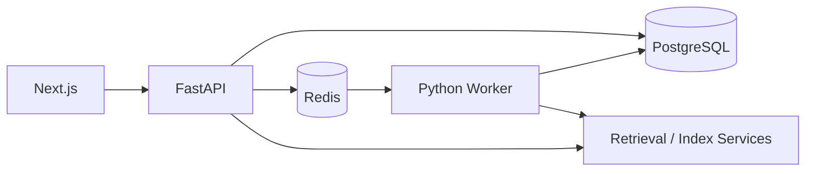
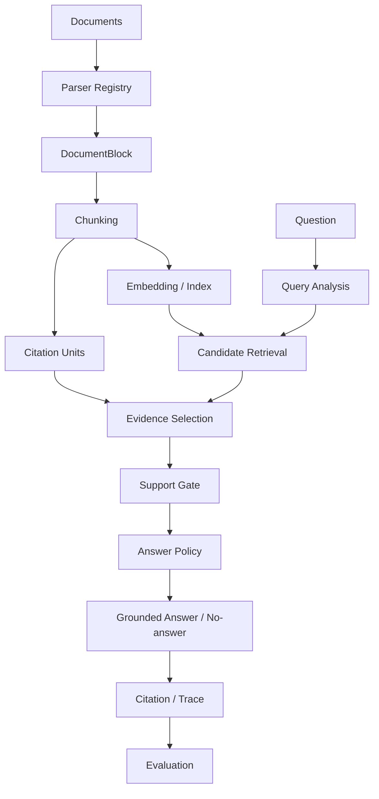

# PureLink

**本地优先、可自部署的 RAG 知识工作台，聚焦可测量的检索、证据选择、可靠引用与可复现评估。**

[English](README.md) | [简体中文](README.zh-CN.md)

[](https://github.com/pmk915/purelink/actions/workflows/ci.yml)
[](https://github.com/pmk915/purelink/actions/workflows/smoke.yml)
[](LICENSE)

**核心结果：**内部 24 例格式基准的证据精度从 **29.6% → 72.5%**，证据召回从 **90% → 100%**。六个 NanoBEIR 任务上的 PureLink Dense nDCG@10 为 **0.6226**，MTEB 参考为 **0.6222**。这些结果来自不同实验，不能合并成一个分数。


## 项目简介

PureLink 将个人、团队知识库与完整的文档问答流程结合起来。上传 TXT、Markdown、DOCX 或含原生文本的 PDF，检查处理状态，提出问题，再沿引用返回支持答案的来源。工作台同时展示回答、检索决策和最终证据。

项目强调可理解的工程边界：解析与分块分开，候选检索与证据选择分开，相关文本与真正支持答案的文本分开。Python 后端和 worker 负责这些决策，前端提供检查入口。本地模型与存储默认配置面向开发和受控自部署。目前功能已冻结，进入作品集展示阶段。

## 为什么做 PureLink

找到正确文档只是问答的一个阶段。检索块可能同时包含目标事实、过期配置、无关表格行或其他实体属性。将这些文本全部交给生成，会得到看似合理但支持不足的回答。

PureLink 让这些阶段可观测并分别测量。内部格式基准的**文档 Recall@5 已达 100%**，最终证据精度却只有 **29.6%**。这个发现将优化重点引向证据选择。受控修改改善了最终证据，同时保留文档排序和既有回归结果。

公共对照带来另一项发现：Dense 路径接近独立 MTEB 参考，而现有 Hybrid 在每个已评估公共任务上的 nDCG 都下降。项目同时保留改进和负面结果，并交代实验边界。

## 核心工程设计

### 1. 结构化文档处理

```text
TXT / Markdown / DOCX / PDF → DocumentBlock → Chunk → Citation Unit
```

Parser Registry 返回统一的 `ParsedDocument` 契约；有序 `DocumentBlock` 保留各解析器实际能够恢复的结构。随后使用已有 fixed 或 block-aware 策略分块。Demo 默认仍是 fixed，内部实验显式使用 block-aware。

**Chunk 是检索与上下文单元，Citation Unit 是更小、带来源信息的证据单元。**检索可以获取较完整上下文，回答则引用更窄的支持语句。引用单元保留处理后文本范围，以及可用的章节和页码信息。

原生 PDF 使用 PyMuPDF 提取按物理页组织的文本块，保留从 1 开始的页码和块级 bbox。即使 block-aware chunk 跨页，source span 仍能为引用恢复准确页码。这是轻量提取方案，布局与 OCR 限制见后文。

### 2. 检索工程

PureLink 提供 dense/vector、keyword、Hybrid、overview 和轻量图候选。规则式 AUTO Router 在 `chunk_only`、`hybrid_text`、`overview`、`graph_vector_mix` 之间选择，记录理由及实际回退模式。

词面通道通过本地确定性评分处理配置键、API 路径和命令等技术标识符；图通道在 PostgreSQL 中保存带来源的实体与一跳关系。这些策略复用当前 service 边界和本地索引。

多种策略都需要追踪和评估，因为效果取决于工作负载。公共实验固定英文 embedding 和文档表示，对比 Dense 与原生产 Hybrid；没有为提高公开分数调整融合权重。

### 3. 证据与回答支持

```text
Candidate Retrieval → Evidence Selection → Evidence Support Gate
  → Answer Policy → Grounded Answer → Citation
```

**检索候选 ≠ 最终证据 ≠ 有支持的答案。**证据选择从检索上下文中挑选 Citation Unit；Support Gate 检查证据是否包含所问事实；Answer Policy 决定是否允许调用生成 provider。缺乏支持时跳过 provider，返回无引用的拒答。

引用身份由后端证据生成。Provider 接收允许使用的 marker 集合，返回后再校验 marker，最后交给 UI。这保护了来源身份与溯源，但启发式支持检查仍有明确限制。

Retrieval Trace 记录 requested/selected/effective mode、路由理由、候选分数、选择后的证据、过滤及支持/策略决策。Document Processing Inspector 展示 blocks、chunks、citation units、索引和 readiness，帮助从工作台定位失败。

### 4. 评估驱动的工程迭代

仓库包含 50 例确定性回归、独立的 24 例多格式基准、M2 → M3 受控证据选择消融，以及公共六任务 NanoBEIR 验证。各实验回答不同问题：预期文档和证据短语诊断内部行为，官方 relevance judgments 提供外部检索参考。

实验保留配置、失败案例与分母，不使用 LLM judge，也不将这些结果合成一个“PureLink 总分”。详细方法与产物见评测文档。

## 系统架构与请求流程

产品栈由 Next.js、FastAPI、PostgreSQL、Redis 和 Python processing worker 组成。上传创建处理任务；解析与索引异步执行，检索和 QA 读取持久化文档状态与本地索引产物。





`worker-go` 是实验性实现，能力与 Python worker 不同，也不是默认 Compose worker。详细边界见 [RAG 架构](docs/architecture/rag-v2-architecture.md)和已核对入口的 [Code Tour](docs/interview/code-tour.md)。

## 评测

### A. 内部回归

50 例跨领域小语料包含 **44 个可回答问题和 6 个无答案问题**，使用 block-aware、`local_hashed_bow / hashed_bow_v1`、AUTO 和关闭/noop reranking，确保结果可重复。

| 指标 | 结果 |
|---|---:|
| 检索命中 / 引用命中 | 43/44 / 43/44 |
| 预期证据命中 | 39/44 |
| 可回答性 | 49/50 |
| 无答案判断正确 | 6/6 |

这是确定性工程回归。[最终脱敏运行](tests/eval/baselines/portfolio-final-auto-block-aware/summary.md)、保留的[历史基线](tests/eval/baselines/answer-policy-auto-block-aware/summary.md)和[指标定义](docs/rag/rag-evaluation.md)记录未解决失败。正常 Demo 使用 fixed 和中文 FastEmbed，其 runtime 结果与此 fixture 配置分开记录。

### B. 证据选择消融

多格式切片共 **24 例**，TXT、Markdown、DOCX、PDF 各六例：20 个可回答问题、四个无答案问题。包含过期干扰文档和两个 PDF 物理第 2 页引用检查。

| 指标 | M2 基线 | M3 保留修改 |
|---|---:|---:|
| 文档 Recall@5 | 100% | 100% |
| 文档 MRR | .925 | .925 |
| 预期证据命中 | 18/20 | 20/20 |
| 证据召回 | 90% | 100% |
| 证据精度 | 29.6% | 72.5% |
| 可回答性 | 20/24 | 24/24 |
| 无答案判断正确 | 4/4 | 4/4 |

保留修改结合 generic selection 的增量问题词覆盖，以及单独发现的共享责任属性匹配修正。语料、文档排序、embedding、chunk 策略和 Answer Policy 固定，原 50 例回归保持不变。

**仅覆盖选择**的实验在 16 个适用案例上得到 78.1% 精度，但证据召回降至 **80%**，因此被拒绝。精度公式不计 unknown evidence，必须同时看适用分母与召回。七个格式案例仍包含 forbidden evidence，例如过期事实和不可拆分的表格行。这些是基于短语的工程指标，不是语义回答准确率。见[受控消融](docs/rag/evidence-selection-ablation.md)和[最终格式运行](tests/eval/baselines/portfolio-final-format-auto-block-aware/summary.md)。

### C. 公共检索验证

**六任务部分 NanoBEIR 外部验证（Six-task partial NanoBEIR external validation）**，共 **300 个查询**：NanoArguAna、NanoClimateFever、NanoDBPedia、NanoFEVER、NanoFiQA2018、NanoHotpotQA，按 MTEB 预定义顺序选择。其余七个因运行时间范围限制明确未评估。

全部配置使用 `BAAI/bge-small-en-v1.5`、FastEmbed 量化 ONNX、384 维、归一化、CPU、top-k=10、关闭 reranking，共用官方 title/text 和 qrels。独立直接编码器由官方 MTEB 完成参考检索/评分；适配器执行 PureLink 生产检索函数。

| Pipeline | nDCG@10 | Recall@10 | MRR@10 |
|---|---:|---:|---:|
| MTEB Dense reference | .6222 | .6710 | .6821 |
| PureLink Dense | .6226 | .6710 | .6826 |
| PureLink Hybrid | .5569 | .6340 | .6055 |

六个任务的 Dense 参考检查全部通过，为编码、索引、相似度与排序提供外部正确性参照。**Hybrid 在六任务上的 nDCG@10 全部低于 Dense**，尽管个别任务的次要指标有所提升。词面融合依赖工作负载；保留负面结果，不在这些任务上调参。这次本地验证不提供官方 MTEB 排名，也不代表完整 NanoBEIR 结果。

[逐任务指标、版本、限制与复现](docs/rag/rag-evaluation.md#public-retrieval-validation)与内部证据实验分开。可选公共基准依赖不进入生产 Docker runtime。

## 演示

[3–5 分钟 Demo Guide](docs/interview/purelink-demo-guide.md)复用已有 fixture 生成两页 PDF。提前准备服务与模型，将 PDF 上传到新建个人 KB，等待 readiness，询问审计保留天数。展示受支持的答案、打开引用查看物理第 2 页来源，再展示最终证据与检索 trace，最后简述上述三个评测故事。

Graph Explorer、团队审核、手动模式和 reranker 配置作为追问材料。额外界面：[Retrieval Trace](docs/assets/screenshots/retrieval-trace.png)、[Processing Inspector](docs/assets/screenshots/processing-inspector.png)。

## 快速开始

使用 Docker Engine 与 Compose v2 或更新版本，或启用当前 WSL 发行版集成的 Docker Desktop。Compose 是首选运行路径。

```bash
git clone https://github.com/pmk915/purelink.git
cd purelink
cp .env.example .env
docker compose up -d --build db redis api worker frontend
docker compose ps
```

等待 PostgreSQL、Redis、API、frontend 健康检查通过，Python worker 应为 running，然后访问：

| 服务 | URL |
|---|---|
| Web | http://localhost:3000 |
| API | http://localhost:8000 |
| OpenAPI | http://localhost:8000/docs |
| Health | http://localhost:8000/api/v1/health |

注册/登录、创建个人 KB、上传文档。[sample_docs](sample_docs/README.md)提供简单文件；Demo Guide 从现有 fixture 生成多页 PDF。

默认 heuristic answer provider 不需要外部 API key。中文 FastEmbed（`BAAI/bge-small-zh-v1.5`）在首次使用时下载模型，缓存到 `/app/models/embedding`，对应宿主机 `./models/embedding`。现场演示前预留下载与索引时间。M4 修正了 provider 语义后，**已有 FastEmbed 索引必须完整重建**；仅凭模型身份无法检测旧通用前缀生成的向量。

本地开发使用 Python 3.12 和 Node 24，安装见[开发命令](docs/development/dev-commands.md)。验证入口是 `make test`、前端 `npm run lint` / `npm run build`、`make docs-check`、`make KEEP_STACK_UP=1 smoke`。评估复现见[测试与 Smoke](docs/development/testing-and-smoke.md)。

## 已实现范围

- 认证、个人 KB ownership、团队 membership/admin 边界、上传审核与会话。
- TXT/Markdown/DOCX/原生文本 PDF 处理、异步任务、诊断与重试/重处理。
- fixed/block-aware chunks、持久化 citation units、带兼容性元数据的本地向量产物，以及轻量来源图数据。
- Dense、词面、Hybrid、overview、graph/vector 候选与可解释规则式 AUTO Router。
- 证据选择、支持检查、Answer Policy、引用校验、retrieval trace，以及确定性/外部评估工具。

这些功能组成一个可检查的工作台；功能存在本身不代表企业部署已验证，也不代表各检索模式质量相同。

## 已知限制

内部数据小且确定性，短语指标是证据质量的近似；六个公共任务只提供有限检索参考。AUTO Router 在大型基准上的泛化未证明。Reranking 是可选能力，此处没有核心改善结果。

证据选择仍是启发式，过期事实、跨文档噪声与多个表格行可能保留。支持检查和 marker 校验建立明确边界，但不能证明语义蕴含，也不能消除所有错误回答。

PDF 提取支持页感知 blocks、bbox 和引用溯源，不保证多栏阅读顺序，没有高级 heading 推断或专用表格结构模型。OCR 可选且默认关闭，原生/扫描混合文档的完整性有限。音视频和通用多模态理解不在本 Demo 范围内。

项目没有企业安全审计或生产规模负载基准，详细取舍见[限制说明](docs/interview/limitations.md)。

## 文档

从[文档索引](docs/README.md)开始：

- [Project Storyline](docs/interview/project-storyline.md)：基于假设与测量的五分钟叙述。
- [Code Tour](docs/interview/code-tour.md)：上传 → 解析 → 分块 → 索引 → 证据 → 回答 → 评估。
- [Demo Guide](docs/interview/purelink-demo-guide.md)：稳定命令、PDF、问题与失败检查。
- [RAG Evaluation](docs/rag/rag-evaluation.md)、[Evidence Ablation](docs/rag/evidence-selection-ablation.md)：指标定义、结果与复现。
- [File Processing](docs/ingestion/file-processing-pipeline.md)、[Answer Policy](docs/rag/answer-policy.md)、[Retrieval Trace](docs/rag/retrieval-trace.md)：实现边界。
- [Portfolio Verification](docs/development/portfolio-verification.md)：最终实际验证命令与结果。

欢迎范围明确的 bug、文档修正和测试，参考 [CONTRIBUTING.md](CONTRIBUTING.md)。本次作品集收口冻结功能开发。

## 安全与部署边界

默认栈面向本地开发与受控自部署。已实现认证和 ownership/membership 检查，但公开部署仍需针对环境完成安全工作：更换开发凭据、设置 CORS、使用 TLS 与反向代理、隔离数据库/cache、制定备份与上传存储控制。暴露服务前阅读 [SECURITY.md](SECURITY.md)与[Docker Deployment](docs/development/docker-deployment.md)。

配置外部 provider 时，文本可能发送到外部服务，需分别理解本地默认与可选集成。项目不声明企业 SaaS 成熟度、安全审计或生产容量。

最终前端 `npm audit` 报告 17 项漏洞提示：2 项 moderate、14 项 high、1 项 critical。建议修复包含 Next.js 主版本升级，本轮功能冻结期间未执行。构建和 smoke 通过不代表这些漏洞已解决，公开部署前仍需处理依赖安全问题。

## License

[MIT](LICENSE)。
