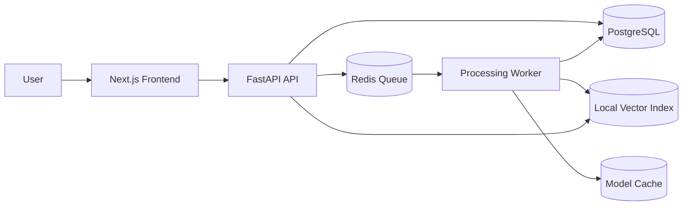

# 架构说明

## 系统定位

PureLink Core 是一个 local-first 文本知识库系统，重点解决团队内部文档沉淀、检索、问答和来源追踪。

当前默认能力只围绕：

- txt
- markdown
- docx
- 普通文本型 PDF
- 异步处理
- 本地语义检索
- answer + citations

它不是默认启用 OCR / ASR / 多模态的通用文件理解平台。

## 系统组件

## 模块职责

### Frontend

- 登录 / 注册
- 个人知识库和团队知识库页面
- 文件上传
- 文档状态展示
- ask 问答交互
- citation 来源展示

### API

- 鉴权
- 用户 / 团队 / 知识库 / 文档接口
- 上传入口
- 创建 `ProcessingJob`
- ask / retrieve / reindex 接口
- 权限控制

### PostgreSQL

主要表：

- `users`
- `teams`
- `knowledge_bases`
- `documents`
- `document_chunks`
- `processing_jobs`
- `conversations`
- `messages`

### Redis

- `processing job queue`
- worker 消费任务

### Worker

- `document_process`
- `document_index`
- `reindex`
- 文本提取
- 文本清洗和质量检测
- chunk 入库
- embedding / index

### Embedding

- 默认：`fastembed` + `BAAI/bge-small-zh-v1.5`
- fallback：`local_hashed_bow`
- `sentence_transformers` 仅保留为 optional，不进入默认安装和默认镜像

### Vector Index

- 当前使用本地索引产物
- 设计上保留后续切换到 `pgvector` / `Qdrant` / `FAISS` 的空间

## 关键后端设计点

### 异步处理而不是上传接口同步处理

上传接口只负责：

- 鉴权
- 权限校验
- 文件类型和大小校验
- sha256 计算
- 保存文件
- 创建 `Document`
- 创建 `ProcessingJob`

真正的文本提取、chunk、embedding 和 index 都由 worker 异步处理。

### sha256 去重

同一个 knowledge base 内，相同 sha256 的文件不会重复创建完整处理链路。这样可以避免：

- 重复保存相同文件
- 重复创建 `document_process` job
- 并发上传相同文件时多条链路同时跑

### worker 原子抢占 job

worker 在处理前会通过数据库状态更新抢占 `queued -> processing`。只有成功抢占的 worker 才能继续执行，避免多个 worker 同时处理同一条 job。

### retry / timeout / locked_by

`ProcessingJob` 记录：

- `retry_count`
- `max_retries`
- `locked_by`
- `locked_at`
- `timeout_at`
- `started_at`
- `finished_at`

这让失败重试、超时判定和排查 worker 行为都有明确落点。

### 文本质量检测

在 chunk 入库前会统一做：

- text sanitation
- control character 清理
- 空文本 / 乱码 / binary-like 文本拦截

低质量文本不会写入 `document_chunks`。

### index metadata 防止混合向量空间

索引元数据会记录：

- `embedding_provider`
- `embedding_model`
- `embedding_dimension`
- `embedding_normalize`
- `created_at`

如果当前配置与已有索引不一致，系统会优先用当前 `DocumentChunk` 自动重建 knowledge base 级索引；如果没有可重建的 chunk 数据，仍然需要手动执行知识库级 `reindex`。核心原则不变：不允许同一个 knowledge base 混入不同 embedding 空间。

### citations 由后端生成

PureLink 的 citations 不是大模型自由生成，而是后端根据真实 retrieval results 结构化生成。这样做的好处是：

- 减少来源编造
- 能追踪到真实 chunk
- 便于后续继续做 preview 和定位
