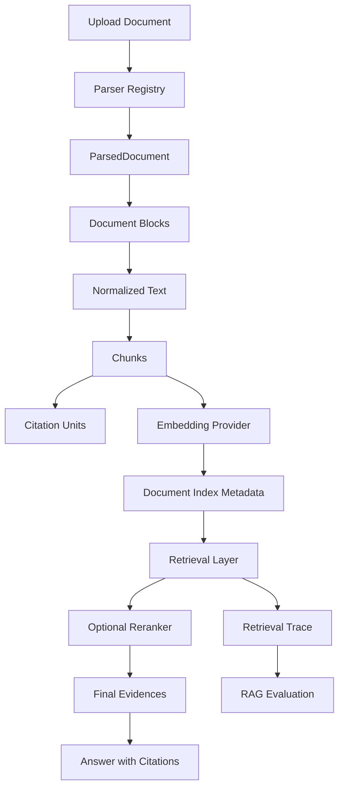

# PureLink RAG v2 Architecture

## Purpose

PureLink RAG v2 is an engineering-oriented RAG core for team and personal knowledge bases.

It is designed to be:

- modular
- provider-agnostic
- citation-aware
- traceable
- evaluable
- ready for lightweight GraphRAG and future Agent tools

It keeps answer grounding inside backend-owned retrieval and citation logic rather than asking the LLM to invent sources.

## End-to-End Flow

```text
Upload Document
  -> Parser Registry
  -> ParsedDocument
  -> Document Blocks
  -> Normalized Text
  -> Chunks
  -> Citation Units
  -> Embedding Provider
  -> Document Index Metadata
  -> Retrieval Layer
  -> Optional Reranker
  -> Retrieval Trace
  -> Answer with Citations
  -> RAG Evaluation
```



## Milestone Summary

### M1: Retrieval Layer

- Solved: QA no longer owns chunk retrieval details.
- Main modules: `app/services/retrieval/`.
- Why it matters: future retrieval modes, reranking, trace, and graph candidates can share one retrieval entrypoint.

### M2: Provider Layer

- Solved: model access is no longer hardcoded into business logic.
- Main modules: `app/providers/`, `app/services/embedding_provider.py`.
- Why it matters: embedding, reranker, and LLM implementations can evolve without rewriting RAG orchestration.

### M3: Optional Reranker

- Solved: retrieval can run a two-stage recall and rerank pipeline.
- Main modules: `app/providers/reranker/`, `app/services/retrieval/rerank_service.py`.
- Why it matters: reranking is optional and disabled by default, so Core deployment stays lightweight.

### M4: Index Metadata

- Solved: PureLink records which provider/model/dimension created each vector index.
- Main modules: `app/models/document_index.py`, `app/services/indexing/`.
- Why it matters: model switches can be detected instead of silently comparing incompatible vectors.

### M5: Retrieval Trace

- Solved: retrieval decisions are observable.
- Main modules: `app/models/retrieval_trace.py`, `app/services/retrieval/trace_service.py`.
- Why it matters: trace records candidates, scores, selected evidence, rerank effects, and filter reasons.

### M6: Document Blocks

- Solved: parsing output is structured before being converted into chunk-compatible text.
- Main modules: `app/services/document_parsing/`, `app/models/document_block.py`.
- Why it matters: headings, tables, code, and source metadata can support better chunking, citations, and graph extraction later.

### M8: RAG Evaluation

- Solved: retrieval quality can be measured with deterministic local cases.
- Main modules: `scripts/eval/`, `tests/eval/`.
- Why it matters: fixed JSONL cases make reranker, retrieval mode, and future GraphRAG comparisons repeatable.

## Lightweight GraphRAG Extension

M7 adds a minimal graph layer:

```text
chunks / citation units
  -> local rule graph extractor
  -> knowledge_entities / knowledge_relations / entity_mentions
  -> graph candidates
  -> vector candidates
  -> merge and optional rerank
  -> final citation-grounded evidence
```

The graph layer stores entities and relations in PostgreSQL. Relations are grounded to source document, chunk, and citation-unit records when available.

`graph_vector_mix` augments vector retrieval with graph candidates. It does not replace vector retrieval.

## Non-Claims

PureLink does not yet claim:

- full multimodal RAG
- full GraphRAG
- full LightRAG compatibility
- complex multi-hop graph reasoning
- graph community detection
- Agent workflow automation
- graph visualization

## SQLite Migration Note

PostgreSQL through Docker Compose is the supported migration validation path.

A full SQLite Alembic upgrade may hit an existing old migration that uses `DROP CONSTRAINT`, which SQLite does not support in the same way as PostgreSQL. That issue is unrelated to the newer RAG v2 migrations.

## Interview and Baseline Packaging

M10 packages the RAG v2 work for interview and portfolio demos:

- `docs/interview/purelink-rag-project-story.md`
- `docs/interview/purelink-rag-resume-description.md`
- `docs/interview/rag-v2-demo-guide.md`
- `tests/eval/purelink_rag_interview_cases.template.jsonl`

The interview eval template is not a default test fixture. Copy it to a local JSONL file, replace local KB IDs and document names, then run `make eval-rag`.
