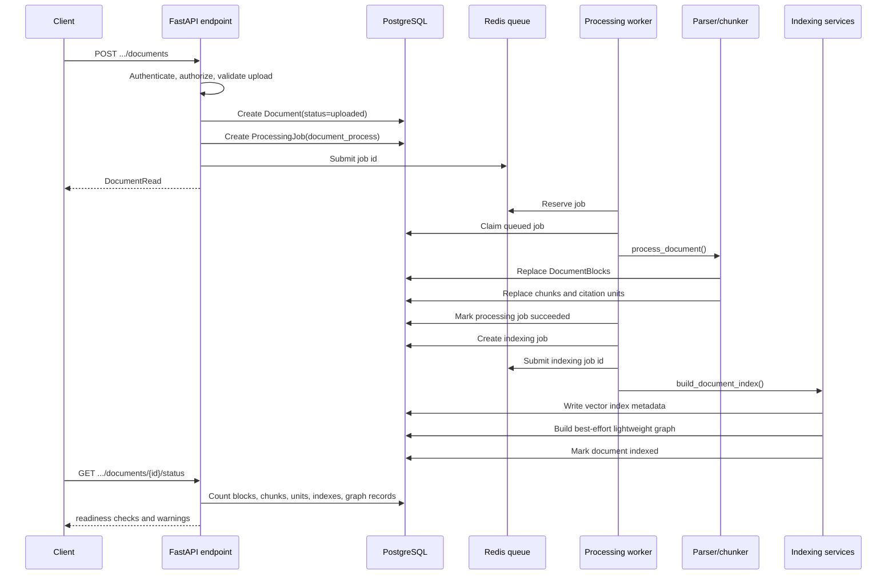

# Backend Request Flow

## Purpose

This guide follows the two backend paths most useful in an interview: an uploaded document becoming RAG-ready, and a question becoming either a cited answer or a deterministic refusal.

## 30-second interview answer

PureLink keeps FastAPI endpoints as permission-aware adapters. Upload endpoints create a document and queue a processing job; a Redis-backed worker parses and persists blocks, chunks, and citation units, then queues vector and lightweight graph indexing. Personal, team, and conversation question endpoints build different access contexts but share one `RetrievalRequest`, `retrieve()`, and `answer_question()` path. Evidence support and answer policy run before the provider, and citations are serialized only from allowed evidence markers actually used in the answer.

## Problem Being Solved

The system needs one retrieval and answer-control path without erasing product differences:

- personal requests require ownership;
- team requests require active membership and approved documents;
- conversation follow-ups need bounded history for recall without letting old messages change current-question routing;
- processing must survive API process restarts and expose progress separately from request latency;
- a retrieved chunk must not automatically become an answer or citation.

## End-to-End Flow

### A. Upload and processing



The personal upload endpoint always submits processing after the document record is created. A team admin upload is immediately approved and submitted; a non-admin team upload remains `pending_review` until the review flow makes it eligible. The worker has separate `document_process` and `document_index` job types. [`run_processing_job_worker()`](../../../app/services/processing_worker.py) queues the indexing job only after parsing and persistence succeed.

[`process_document()`](../../../app/services/document_processing.py) performs parser routing, block persistence, chunk generation, citation-unit generation, and atomic replacement of the document's chunks/units. [`build_document_index()`](../../../app/services/document_indexing.py) writes vector index metadata, invokes the lightweight graph builder, and marks the document `indexed`. Graph extraction is best-effort: [`build_document_graph_index()`](../../../app/services/knowledge_graph/graph_index_service.py) records a failed graph index and returns an empty result instead of failing an otherwise successful vector index.

Readiness is computed on demand by [`build_document_status()`](../../../app/services/document_status.py). Base RAG requires non-failed processing, chunks, citation units, a compatible ready vector index, and no active error. A missing graph index is optional and does not make base RAG unready.

### B. Question and answer

```mermaid
sequenceDiagram
    participant U as Client
    participant A as Endpoint adapter
    participant R as retrieve()
    participant G as Evidence Support Gate
    participant P as Answer Policy
    participant L as Answer provider
    participant C as Citation builder

    U->>A: personal/team ask or conversation message
    A->>A: Resolve authorized KB and eligible documents
    A->>R: RetrievalRequest
    R->>R: AUTO decision or manual bypass
    R->>R: Retrieve, merge, select evidence, optional rerank
    R-->>A: RetrievalResult + trace id
    A->>G: question + final evidence units
    G-->>P: answerable, reason, support signals
    P->>P: Check reliable and citation-ready final evidence
    alt policy allows provider
        P->>L: Prompt + allowed evidence markers
        L-->>P: Generated text with markers
        P->>P: Remove unknown markers
        P->>C: Used valid markers only
        C-->>A: CitationRead list
    else policy refuses
        P-->>A: no-reliable-evidence response; citations=[]
    end
    A->>A: Persist conversation exchange
    A-->>U: Answer response
```

The three public question adapters are:

- `POST /api/v1/knowledge-bases/{knowledge_base_id}/ask` in [`knowledge_bases.py`](../../../app/api/v1/knowledge_bases.py);
- `POST /api/v1/teams/{team_id}/knowledge-bases/{knowledge_base_id}/ask` in [`team_knowledge_bases.py`](../../../app/api/v1/team_knowledge_bases.py);
- `POST /api/v1/conversations/{conversation_id}/messages` in [`conversations.py`](../../../app/api/v1/conversations.py).

All three call [`retrieve()`](../../../app/services/retrieval/retrieval_service.py), then [`answer_question()`](../../../app/services/qa.py), and persist the exchange through [`persist_question_answer_exchange()`](../../../app/services/conversation.py). Personal and team `/ask` accept AUTO or a manual public mode. Conversation append always requests AUTO and uses two query fields: bounded history may augment `query` for retrieval, while the current message remains `evidence_query` for routing, evidence selection, reranking, and support checks.

The adapters differ in authorization and document eligibility. Personal retrieval requires the owner and `not_required` review status. Team retrieval requires active membership and only `approved` documents. Conversation access is resolved from the conversation and associated KB, then applies the same scope-specific review rule.

## Core Data Structures

- [`Document`](../../../app/models/document.py): uploaded-file record and processing status.
- [`ProcessingJob`](../../../app/models/processing_job.py): job type, trigger, attempt, step, lock, timeout, and failure fields.
- [`RetrievalRequest` and `RetrievalResult`](../../../app/services/retrieval/types.py): shared retrieval input and output contracts.
- [`QuestionAnswerResult`](../../../app/services/qa.py): internal answer, citations, prompt, support decision, and policy decision.
- [`QuestionAnswerResponse` and `CitationRead`](../../../app/schemas/qa.py): public ask response contract.

## Verified Code Entry Points

- Application/API assembly: [`app/api/router.py`](../../../app/api/router.py), [`app/core/application.py`](../../../app/core/application.py).
- Upload adapters: [`knowledge_bases.py`](../../../app/api/v1/knowledge_bases.py), [`team_knowledge_bases.py`](../../../app/api/v1/team_knowledge_bases.py).
- Worker entry: [`run_processing_worker_loop()`](../../../app/workers/processing_worker_main.py), [`execute_processing_job()`](../../../app/services/processing_worker.py).
- Processing/indexing: [`process_document()`](../../../app/services/document_processing.py), [`build_document_index()`](../../../app/services/document_indexing.py).
- Shared QA path: [`retrieve()`](../../../app/services/retrieval/retrieval_service.py), [`answer_question()`](../../../app/services/qa.py).
- Product context: [File Processing Pipeline](../../ingestion/file-processing-pipeline.md) and [Retrieval Layer](../../rag/retrieval-layer.md).

## Failure and Fallback Behavior

- Upload validation and active-job limits fail before a document job is submitted.
- `process_document()` rolls back failed writes, marks the document failed, and exposes a stable processing error code where available.
- Retryable job errors are requeued until `max_retries`; unsupported formats, unavailable OCR, low-quality text, and similar configured non-retryable errors are finalized.
- Vector index failures leave index failure metadata and do not mark the document indexed.
- Graph indexing failure is recorded but does not block vector-index completion.
- Graph or hybrid retrieval can fall back to `chunk_only`; requested, selected, and effective modes remain distinct.
- If support or citation readiness fails, answer policy does not call the provider and returns an empty citation list.
- If the provider returns only unknown markers, marker validation produces no usable markers and QA replaces the generated text with the no-reliable-evidence response.

## Tests and Verification

- [`tests/test_documents.py`](../../../tests/test_documents.py): upload, personal/team/conversation ask paths, provider-call metadata, citations, and refusals.
- [`tests/test_processing_jobs.py`](../../../tests/test_processing_jobs.py): job lifecycle and retry endpoints.
- [`tests/services/document_parsing/test_processing_integration.py`](../../../tests/services/document_parsing/test_processing_integration.py): parser-to-persistence integration.
- [`tests/services/indexing/test_document_indexing_integration.py`](../../../tests/services/indexing/test_document_indexing_integration.py): vector indexing and metadata.
- [`tests/test_document_status.py`](../../../tests/test_document_status.py): readiness checks and optional graph status.

## Design Trade-offs

- Endpoint adapters repeat some scope setup, but permissions remain explicit and the retrieval/QA core is shared.
- PostgreSQL stores job state while Redis carries job ids. This supports recovery, but it is not a general workflow engine.
- Graph indexing is deliberately non-blocking for base RAG, trading strict graph consistency for upload availability.
- Conversation history affects recall through a bounded retrieval query, not the current-question policy classification.

## Known Limitations

- Processing and indexing are separate jobs rather than one transaction; status metadata is the recovery boundary.
- Redis delivery is recovered with queued/inflight reconciliation, not exactly-once execution.
- The public ask response exposes retrieval routing fields, but Evidence Support Gate and Answer Policy internals remain trace metadata rather than frontend fields.
- The graph extractor is local and rule-based, so `graph_vector_mix` coverage depends on extracted entities and relations.

## Common Interview Follow-ups

**Why not run processing in the upload request?** It would couple request latency and failure handling to parsing and embedding. Persisted jobs make progress, retries, and recovery observable.

**What is actually shared by the three question endpoints?** `RetrievalRequest`, `retrieve()`, `answer_question()`, citation construction, trace recording, and conversation persistence. Authorization and review-status setup remain endpoint-specific.

**Can an unsupported question reach the LLM?** No. The deterministic policy sets `allow_provider_call=False`, and QA returns the refusal directly.

**Does graph failure break ordinary Q&A?** No. Graph build failure is recorded, and graph retrieval can fall back to vector-backed `chunk_only`.

**How are conversation follow-ups handled?** Recent messages build a bounded retrieval query, while the current message remains the evidence/policy query.

**Where is RAG readiness decided?** `build_document_status()` derives it from processing state, persisted chunks/units, vector index compatibility/status, and errors.

## Concise Answer Examples

**Request layering:** "The API owns authentication and scope adaptation; services own processing, retrieval, support, policy, and citation construction."

**No-answer path:** "A support or provenance failure is a pre-generation refusal, so the provider is not called and citations remain empty."

**Worker reliability:** "PostgreSQL is the job source of truth, Redis carries work, and startup/periodic recovery resubmits queued jobs."
