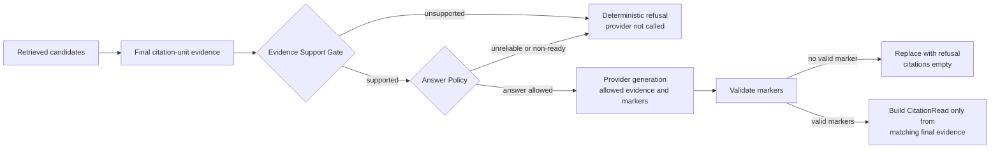

# Evidence, Answer Policy, and Citations

## Purpose

This guide separates the stages between retrieving relevant text and returning a cited answer. It is the core explanation for PureLink's deterministic no-answer behavior and citation contract.

## 30-second interview answer

PureLink does not treat retrieval score as permission to answer. After final citation-unit evidence is selected, the Evidence Support Gate checks query-type-specific coverage such as entity, attribute, relation, or exact technical value. A separate Answer Policy requires a positive support decision, reliable retrieval context, and citation-ready provenance before it allows the provider call. Provider markers are then validated against an allowlist, and `CitationRead` objects are built only for valid markers that map to the same final evidence.

## Problem Being Solved

Three tempting assumptions are unsafe:

```text
retrieved evidence != evidence that supports the requested fact
supported evidence != an automatically permitted provider call
generated marker != a valid citation
```

A semantically nearby chunk may discuss a product but omit the requested processor. A support check can pass while a legacy evidence row lacks a stable source locator. A provider can output `[S99]` even though only `[S1]` and `[S2]` were supplied. PureLink makes each boundary explicit and observable.

## End-to-End Flow



The stages are:

1. **Retrieval relevance:** [`retrieve()`](../../../app/services/retrieval/retrieval_service.py) produces ranked `RetrievedEvidence` and aligned raw citation units.
2. **Evidence support:** [`evaluate_evidence_support()`](../../../app/services/evidence_support.py) classifies the question and evaluates mandatory coverage over final evidence.
3. **Answerability:** the support decision's `answerable` flag records whether those mandatory checks passed. It is deterministic evidence answerability, not generated-answer correctness.
4. **Answer policy:** [`decide_answer_policy()`](../../../app/services/answer_policy.py) combines support, reliable context, final evidence presence, and citation readiness.
5. **Provider generation:** [`_answer_with_context_chunks()`](../../../app/services/qa.py) calls the configured generator only when `allow_provider_call=True`.
6. **Marker validation:** `validate_provider_markers()` normalizes valid markers, removes unknown ones, and records used markers.
7. **Citation serialization:** `build_answer_citations()` maps used markers back to both the allowed citation units and canonical final evidence, then constructs public `CitationRead` values.

## Core Data Structures

### Evidence Support Gate

[`EvidenceSupportDecision`](../../../app/services/evidence_support.py) contains:

- `answerable` and a bounded `support_score`;
- a stable `reason` and `query_type`;
- boolean/debug `signals`;
- supporting and rejected evidence ids.

The gate recognizes `entity_definition`, `entity_attribute`, `entity_reason`, `entity_relation`, `exact_technical`, `overview`, and `generic_factual`. Mandatory behavior varies:

- exact technical questions need normalized identifier/lexical coverage and requested intent such as a default or supported value;
- relation questions need both entity coverage and a relation expression, with conservative same-document/local-scope combination;
- attributes need the requested attribute;
- reasons need reason/causal-purpose coverage;
- definitions need entity and definition/lexical coverage;
- overview accepts non-empty supporting evidence;
- generic factual evidence remains permissive after final evidence selection.

The weighted support score is a debugging summary. [`_unsupported_reason()`](../../../app/services/evidence_support.py) applies mandatory checks after scoring, so a high aggregate signal cannot override a missing required attribute or relation.

The gate does not itself rewrite the final evidence list. Supporting/rejected ids are recorded for diagnostics; the current Answer Policy evaluates the canonical final evidence set passed to it. This makes upstream evidence precision important.

### Deterministic Answer Policy

[`AnswerPolicyDecision`](../../../app/services/answer_policy.py) contains:

- `outcome`: currently inferred as `answer` or `refuse`; partial/conflict enum values are reserved but not inferred;
- `reason` and `allow_provider_call`;
- `citation_required` and `external_knowledge_allowed`;
- an allowlist of `evidence_markers`;
- deterministic provider instructions and optional unsupported/conflict notes.

For an answer, every final evidence must be citation-ready: it needs a persisted `citation_unit_id`, a non-empty source locator, and a normalized marker. Mixed ready/non-ready final evidence is refused rather than silently dropping the non-ready item. The policy sets `citation_required=True` and `external_knowledge_allowed=False`.

For a refusal, `allow_provider_call=False`, `citation_required=False`, and marker allowlist is empty. [`qa.py`](../../../app/services/qa.py) returns `NO_RELIABLE_EVIDENCE_MESSAGE` and `citations=[]` without resolving or invoking an answer generator.

### Allowed evidence and prompt contract

QA intersects selected citation units with the policy's allowed markers. Only those units are rendered into the fact/overview prompt. Policy instructions require the provider to use supplied evidence, avoid external facts, cite every factual claim, and use only allowed markers.

The context contains fine-grained unit text and provenance labels. A broad `parent_chunk_text` is not substituted for final citation evidence. The bounded persisted-unit fallback may inspect units from already selected context chunks, but it does not add unselected chunks or fabricate provenance.

### Marker validation and compatibility

Stable markers are evidence identities such as `S1`, not array offsets. Reranking and deduplication can change evidence order, and citations are emitted in first-used valid-marker order rather than assumed retrieval rank.

Backend marker validation accepts canonical `[S1]` and normalizes legacy numeric `[1]` to `S1`. It removes unknown markers while preserving valid ones. If no valid marker remains, QA rejects the provider output and returns no citations. The frontend parser in [`citation-markers.ts`](../../../frontend/lib/citation-markers.ts) also supports `S` and legacy numeric forms, while avoiding likely list indices and Markdown links. New prompts and responses use `S` markers; numeric support is compatibility behavior, not the preferred contract.

### Public `CitationRead` contract

[`CitationRead`](../../../app/schemas/qa.py) exposes:

- identity/provenance: `citation_id`, `citation_marker`, `citation_unit_id`, `chunk_db_id`, `chunk_id`, `document_id`, `knowledge_base_id`, `scope`, `team_id`;
- display evidence: `document_name`, `snippet`, `text`;
- source metadata: `source_type`, character range, page, time range, section, heading path;
- structured `source_locator` and `preview_target` values from [`source_locator.py`](../../../app/schemas/source_locator.py);
- readiness/ranking: `citation_ready`, `retrieval_mode`, and final `score`.

The API keeps ids for stable client correlation and debugging. The [`CitationDrawer`](../../../frontend/components/qa/citation-drawer.tsx) intentionally emphasizes document name, quoted evidence, source type, page/section/heading/range, preview navigation, readiness, mode, and score. It does not display database ids because they do not help a user verify a claim; human-readable provenance does. This is a UI choice, not a claim that ids are absent from the API.

Personal and team `/ask` return the same `QuestionAnswerResponse`. Conversation messages serialize the same `CitationRead` list when persisting an assistant message and deserialize it through [`conversation.py`](../../../app/services/conversation.py), so the drawer receives one citation shape across all three flows.

## Verified Code Entry Points

- Evidence decision: [`evidence_support.py`](../../../app/services/evidence_support.py).
- Policy and marker validation: [`answer_policy.py`](../../../app/services/answer_policy.py).
- Orchestration and citation mapping: [`qa.py`](../../../app/services/qa.py).
- Canonical evidence/readiness: [`citation_builder.py`](../../../app/services/retrieval/citation_builder.py).
- Public schema and locators: [`qa.py` schema](../../../app/schemas/qa.py), [`source_locator.py`](../../../app/schemas/source_locator.py).
- Frontend consumption: [`citation-aware-answer.tsx`](../../../frontend/components/qa/citation-aware-answer.tsx), [`citation-drawer.tsx`](../../../frontend/components/qa/citation-drawer.tsx).
- Design context: [Answer Policy](../../rag/answer-policy.md) and [Retrieval and Citations](../../retrieval-and-citations.md).

## Failure and Fallback Behavior

### Case A: sufficient evidence

Question: `CHUNK_STRATEGY 支持哪些值？`

Final evidence identifies the normalized configuration key and contains supported values such as `fixed` and `block_aware`. The support gate passes exact-technical identifier and intent checks. All final evidence has unit ids and locators, so policy allows the provider with `[S1]`/`[S2]`. If the provider uses `[S1]`, only the final evidence mapped to `S1` becomes a citation.

### Case B: insufficient evidence

Question: `RETRIEVAL_MIN_SCORE 的默认值是什么？`

Evidence that only says the score controls filtering lacks the requested default value. The support reason is insufficient query coverage. Policy refuses, the provider is not called, and the response contains the no-reliable-evidence message with `citations=[]`.

### Case C: unknown provider marker

Allowed markers are `S1` and `S2`, but the provider returns `A fact [S99]`. Validation removes `S99` and increments `answer_unknown_markers_removed`. Because no valid marker remains, the generated answer is replaced by the refusal and no citation is fabricated. If a response contained both `[S1]` and `[S99]`, the unknown marker would be removed and the valid `S1` mapping could remain.

Other failure paths include no final evidence, low/unreliable retrieval scores for factual QA, no citation-ready evidence, mixed provenance readiness, and valid markers that fail to map to both selected units and final evidence. Each path records a policy reason in retrieval trace metadata.

## Tests and Verification

- [`tests/services/test_evidence_support.py`](../../../tests/services/test_evidence_support.py): mandatory positive/negative support behavior.
- [`tests/services/test_evidence_support_holdout.py`](../../../tests/services/test_evidence_support_holdout.py): generalized identifier, relation, and no-answer boundaries.
- [`tests/services/test_answer_policy.py`](../../../tests/services/test_answer_policy.py): provider-call policy, readiness, trace metadata, and unknown marker removal.
- [`tests/services/retrieval/test_citation_readiness.py`](../../../tests/services/retrieval/test_citation_readiness.py): persisted-unit fallback bounds and provenance preference.
- [`tests/test_retrieval_pipeline.py`](../../../tests/test_retrieval_pipeline.py): selection, provider/refusal, marker validation, citation construction, and trace integration.
- [`tests/test_documents.py`](../../../tests/test_documents.py): public personal/team/conversation citation responses.

## Design Trade-offs

- Deterministic support checks are explainable and testable, but they approximate language and cannot prove semantic truth.
- Refusing mixed citation readiness is stricter than dropping weak provenance; it favors citation alignment over answer coverage.
- Keeping support and policy separate prevents a support score from deciding operational concerns such as provider calls and citation readiness.
- Marker allowlisting prevents fabricated citation mappings, but a valid marker still does not prove that every generated clause is perfectly entailed.

## Known Limitations

- Support rules use curated aliases, identifier normalization, relation scopes, and lexical signals; unseen phrasing can still cause false acceptance or refusal.
- Generic factual support is less strict than specialized entity/technical categories.
- Supporting evidence ids are diagnostic; the gate does not currently narrow the final evidence set before policy.
- Answer Policy does not yet infer partial-answer or conflict outcomes even though enum values exist.
- Internal support and policy metadata is stored in traces but is not exposed as dedicated fields in the current Citation Drawer.
- Marker validation checks marker membership, not claim-level natural-language entailment.

## Common Interview Follow-ups

**Why are support and policy separate?** Support asks whether evidence covers the question; policy asks whether generation is operationally allowed with reliable, citation-ready evidence.

**Does no-answer call DeepSeek or another provider?** No. Provider resolution/call happens only after `allow_provider_call=True`.

**Can the model cite an unknown source?** It can emit the text, but validation removes unknown markers and never creates a citation for them.

**Why must all final evidence be citation-ready?** Otherwise the provider could use an allowed fact that the response cannot link back to a stable source.

**Is `[S1]` the first citation array element?** It is a stable marker attached to final evidence. The array is built from valid markers actually used, so positional equivalence must not be assumed.

**Why keep database ids in the API but hide them in the drawer?** They support correlation and debugging; users verify claims through document, evidence, and source location.

**Does the gate eliminate hallucinations?** No. It blocks known unsupported/provenance states deterministically, but it is not a semantic verifier of every generated clause.

## Concise Answer Examples

**Core distinction:** "Retrieval ranks candidates; support checks requested facts; policy controls generation; marker validation controls citation mapping."

**Refusal:** "When evidence support or citation alignment fails, the provider call is skipped and the citation list is empty."

**Citation integrity:** "A citation is created only when a used allowlisted marker maps to both the selected unit and canonical final evidence."
