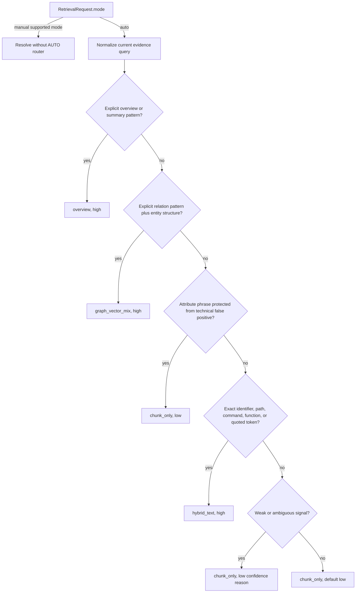

# Retrieval Routing and Ranking

## Purpose

This guide explains the unified retrieval contract, deterministic AUTO routing, mode-specific candidate generation, optional reranking, evidence selection, fallback, and trace observability.

## 30-second interview answer

PureLink exposes one async `retrieve(RetrievalRequest)` boundary. Manual modes bypass routing; AUTO applies deterministic patterns and records requested, selected, and effective modes separately. `chunk_only` uses the existing vector-plus-lexical chunk retriever, `overview` selects representative chunks across documents, `hybrid_text` adds a technical-token keyword candidate path, and `graph_vector_mix` augments vector candidates with graph-linked chunks. All modes converge on citation-unit selection, optional reranking, and retrieval tracing.

## Problem Being Solved

One retrieval strategy is not equally useful for every question:

- broad summaries need document coverage rather than only nearest neighbors;
- exact paths, identifiers, and commands benefit from deterministic token matching;
- explicit relation questions can use entity/relation provenance;
- most factual questions should keep the simpler baseline;
- callers need to know whether the executed mode differs from the requested or routed mode.

The retrieval layer owns those choices so QA generation does not duplicate retrieval logic.

## End-to-End Flow

```text
RetrievalRequest
  -> select AUTO decision or resolve manual mode
  -> validate DB/scope/review/vector context
  -> filter vector-index-incompatible documents
  -> retrieve mode-specific chunk candidates
  -> apply graph/hybrid fallback when needed
  -> select context chunks
  -> load and score persisted citation units
  -> build RetrievedEvidence
  -> optional reranker
  -> record trace header/items/metadata
  -> build marker-bearing context_text
  -> RetrievalResult
```

### AUTO decision flow



This is the current code order in [`route_query()`](../../../app/services/retrieval/query_router.py): overview, explicit relation, an attribute-question guard, exact technical signal, then low-confidence/default `chunk_only`. It is not an LLM classifier. Manual `chunk_only`, `overview`, `hybrid_text`, or `graph_vector_mix` returns `confidence=manual` and `reason="manual mode specified"`; AUTO cannot override it.

Examples:

- technical: ``RETRIEVAL_MIN_SCORE 在哪里配置？`` matches an uppercase underscore identifier and selects `hybrid_text`;
- relation: `Alice Chen 和 Bob Li 是什么关系？` has an explicit relation phrase and two-entity structure, selecting `graph_vector_mix`;
- overview: `总结 Python classes 文档` matches a summary pattern and selects `overview`;
- ambiguous: `dependency injection 是什么？` contains a weak technical/relation word but no exact identifier or relation structure, so it stays `chunk_only` with low confidence.

## Core Data Structures

[`app/services/retrieval/types.py`](../../../app/services/retrieval/types.py) defines the shared models:

- `RetrievalMode`: `auto`, `chunk_only`, `overview`, `hybrid_text`, `graph_vector_mix`, plus `graph_local` and `graph_global` enum placeholders. The public ask schema accepts only the implemented AUTO/manual modes; unsupported internal placeholders resolve to `chunk_only`.
- `RetrievalRequest`: query, KB/user, mode, top-k, filters, citation/trace switches, team/conversation context, and internal DB/document/index dependencies. `evidence_query` can preserve the current question separately from a conversation-expanded retrieval query.
- `RetrievedEvidence`: normalized unit/chunk provenance plus vector, keyword, graph, rerank, and final scores.
- `RetrievalResult`: requested/selected/effective/fallback modes, final evidence, rendered context, reranker use, trace id, and internal intermediate collections.

### Mode comparison

| Mode | Candidate behavior | Best fit | Conservative fallback |
|---|---|---|---|
| `chunk_only` | Existing chunk retriever merges vector-index candidates with DB lexical candidates, metadata score, and indexed-document bonus | Default factual questions | Corrupt/missing vector search can continue from DB lexical chunks |
| `overview` | Scores all eligible chunks for summary-like sections/content and round-robins up to per-document/global limits | Cross-document or document-level summaries | No automatic mode fallback; empty eligible corpus returns no evidence |
| `hybrid_text` | Runs `chunk_only` candidate retrieval plus a separate exact-token keyword retriever, then merges | Paths, config keys, function names, commands, error codes | Reports effective `chunk_only` when keyword fails, is empty, or adds no signal; vector/baseline candidates are preserved |
| `graph_vector_mix` | Starts with baseline chunks, retrieves chunks linked to matched graph entities/relations, then merges | Explicit entity relations and dependencies | Effective `chunk_only` when graph fails, is empty, or all graph candidates are below `RETRIEVAL_MIN_SCORE` |
| `auto` | Selects one concrete mode using the rule flow above | Caller delegates deterministic mode choice | AUTO itself never reaches a low-level retriever |

### Baseline chunk scoring

[`chunk_retriever.py`](../../../app/services/retrieval/chunk_retriever.py) retrieves up to `max(top_k * 4, 12)` vector and DB lexical candidates. It max-normalizes each channel and computes:

```text
score = min(1.0,
    0.55 * normalized_vector
  + 0.35 * normalized_lexical
  + 0.10 * metadata_match
  + 0.03 if the document is indexed
)
```

Metadata matching uses section title, heading path, source locator/type, and page. This means the current `chunk_only` name describes the retrieval unit, not a vector-only algorithm.

### Additional hybrid-text merge

[`retrieve_hybrid_text_chunks()`](../../../app/services/retrieval/hybrid_text_retriever.py) combines baseline candidates with [`retrieve_keyword_chunks()`](../../../app/services/retrieval/keyword_retriever.py). The keyword path expands paths, filenames, uppercase/snake-case tokens, separators, and short Chinese terms. Its score includes matched-query ratio, exact phrase, document-name, and technical-token bonuses; candidates below `KEYWORD_RETRIEVAL_MIN_SCORE` are dropped.

Candidates deduplicate by database chunk id, then document/chunk key, then a stable document/locator/text hash fallback. For a candidate present in both channels:

```text
combined = 0.7 * normalized_vector + 0.3 * normalized_keyword
```

Vector-only candidates keep their vector score. Keyword-only candidates keep their keyword score. The merged object preserves `vector_score`, `keyword_score`, `matched_terms`, and ordered `candidate_sources`, then sorts by score, document id, and chunk id.

### Graph-vector mix

[`retrieve_graph_chunks()`](../../../app/services/knowledge_graph/graph_retriever.py) extracts query entity names and matches normalized [`KnowledgeEntity`](../../../app/models/knowledge_graph.py) rows within the KB. Entity mentions with a chunk produce score `1.0`. Relation-source chunks start at `0.7`, with bounded bonuses when the relation type appears in the query and when relation confidence is present.

Graph and vector chunks deduplicate by `(document_id, chunk_id)` and keep the higher score; this is augmentation, not a graph/vector weighted average. Graph data is produced by a local rule extractor. Each relation row can point to its source document, chunk, and citation unit, while entity mentions carry document/chunk/unit and source locator provenance. It is a lightweight relational index in PostgreSQL, not a traversal database or full GraphRAG implementation.

### Optional reranker

Reranking is disabled by default: `RERANKER_ENABLED=false`, `RERANKER_PROVIDER=noop`. Implemented providers are `noop`, `local_rule_reranker`, and optional `flagembedding`; configured placeholders such as external API or LLM rerankers raise a provider error.

When a non-noop reranker is enabled, retrieval expands initial recall to at least `RERANKER_TOP_N` (default 50), converts evidence to `RerankCandidate`, and keeps up to the request's final `top_k`. `local_rule_reranker` scores exact phrase, token overlap/recall, and a small metadata match. `rerank_score` becomes `final_score`, and context chunks/units are realigned to reranked evidence.

`FINAL_CONTEXT_TOP_K` is present in [`Settings`](../../../app/core/config.py) with default 8, but the current unified retrieval path does not read it; the request `top_k` is the active final limit. Also, an enabled reranker provider exception is not automatically converted to noop: it propagates through `retrieve()`, which closes the trace with error metadata. These are current configuration/fallback limitations.

### Retrieval trace

[`trace_service.py`](../../../app/services/retrieval/trace_service.py) stores a trace header and bounded item previews. Trace metadata includes:

- `requested_mode`, `selected_mode`, `effective_mode`;
- `router_reason`, `router_confidence`, `router_type`, and routing query source;
- `fallback_mode` and `fallback_reason`;
- context/evidence/graph/keyword counts and citation-readiness summary;
- later merges from Evidence Support Gate and Answer Policy.

Items record document/chunk/citation-unit provenance, vector/keyword/graph/rerank/final scores, initial/rerank/final ranks, context selection, index identity, and filtering reason. Trace data explains a decision; it is not an input to answer generation.

## Verified Code Entry Points

- Contract and orchestration: [`types.py`](../../../app/services/retrieval/types.py), [`retrieve()`](../../../app/services/retrieval/retrieval_service.py), [`resolve_mode()`](../../../app/services/retrieval/retrieval_router.py).
- AUTO: [`route_query()`](../../../app/services/retrieval/query_router.py).
- Candidate paths: [`chunk_retriever.py`](../../../app/services/retrieval/chunk_retriever.py), [`overview_retrieval.py`](../../../app/services/overview_retrieval.py), [`hybrid_text_retriever.py`](../../../app/services/retrieval/hybrid_text_retriever.py), [`graph_retriever.py`](../../../app/services/knowledge_graph/graph_retriever.py).
- Reranking and trace: [`rerank_service.py`](../../../app/services/retrieval/rerank_service.py), [`trace_service.py`](../../../app/services/retrieval/trace_service.py).
- Architecture context: [Retrieval Layer](../../rag/retrieval-layer.md), [Lightweight GraphRAG](../../rag/lightweight-graphrag.md), and [Retrieval Trace](../../rag/retrieval-trace.md).

## Failure and Fallback Behavior

- Index compatibility filtering removes stale/mismatched vector documents before candidate generation and records reasons.
- Baseline chunk retrieval catches vector-index search errors and can use DB lexical candidates.
- Hybrid keyword failures preserve baseline candidates and set fallback metadata.
- Graph failures, empty results, or below-threshold graph candidates use effective `chunk_only`.
- Evidence-unit selection can use a bounded persisted-unit fallback only from already selected context chunks.
- Noop/disabled reranking preserves order and reports `used_reranker=false`.
- Enabled reranker failures currently propagate; they are traced but do not silently preserve pre-rerank results.

## Tests and Verification

- [`tests/services/retrieval/test_query_router.py`](../../../tests/services/retrieval/test_query_router.py) and [`test_query_router_holdout.py`](../../../tests/services/retrieval/test_query_router_holdout.py): rule boundaries, false positives, confidence, and manual bypass.
- [`tests/services/retrieval/test_hybrid_text_retrieval.py`](../../../tests/services/retrieval/test_hybrid_text_retrieval.py): channel merge, deduplication, and keyword failure.
- [`tests/services/retrieval/test_keyword_retriever.py`](../../../tests/services/retrieval/test_keyword_retriever.py): token extraction and keyword scoring.
- [`tests/services/retrieval/test_graph_vector_mix.py`](../../../tests/services/retrieval/test_graph_vector_mix.py): graph augmentation and fallback.
- [`tests/services/retrieval/test_rerank_integration.py`](../../../tests/services/retrieval/test_rerank_integration.py) and [`test_trace_integration.py`](../../../tests/services/retrieval/test_trace_integration.py): final ranking and observability.

## Design Trade-offs

- Deterministic routing is explainable and cheap, but vocabulary/pattern coverage is finite.
- Local keyword retrieval avoids a search-server dependency, but scans eligible database chunks and is not an inverted index.
- Max-score graph merging is simple and stable, but does not calibrate graph and vector score distributions.
- Keeping requested, selected, and effective modes separate adds fields but makes fallback measurable.

## Known Limitations

- AUTO patterns are multilingual but manually curated; high router accuracy on the committed corpus is not universal intent classification accuracy.
- Overview selection is heuristic and is the weakest category in the committed baseline.
- `graph_local` and `graph_global` are enum placeholders, not public implemented retrieval modes.
- Graph extraction and retrieval are one-hop, rule-based, and source-chunk oriented.
- `FINAL_CONTEXT_TOP_K` is currently configuration debt; request `top_k` controls final evidence count.
- An enabled reranker failure has no automatic pre-rerank fallback.

## Common Interview Follow-ups

**Is `chunk_only` vector-only?** No. The current baseline merges vector, lexical, metadata, and a small indexed-document bonus at chunk granularity.

**Why have a separate `hybrid_text` mode?** It adds a technical-token-oriented keyword candidate path with path/identifier expansion and observable matched terms.

**Why not use an LLM router?** Rule routing is deterministic, testable, cheap, and exposes a reason; it avoids another model call before retrieval.

**Can manual mode be changed by AUTO?** No. Manual mode bypasses `route_query()` entirely, though the selected mode can still have an execution fallback.

**What does selected vs effective mean?** Selected is the router/manual decision; effective is what ran after graph or hybrid fallback.

**Does graph retrieval replace vector retrieval?** No. It retrieves source chunks linked to graph records and merges them with baseline candidates.

## Concise Answer Examples

**AUTO:** "It is a deterministic mode classifier with explicit confidence and reason, not an agent or model router."

**Hybrid:** "The technical keyword channel is merged with baseline retrieval, deduplicated by chunk identity, and preserves channel-specific scores."

**Trace:** "I record requested, selected, effective, and fallback modes separately so routing quality and execution behavior are independently debuggable."
