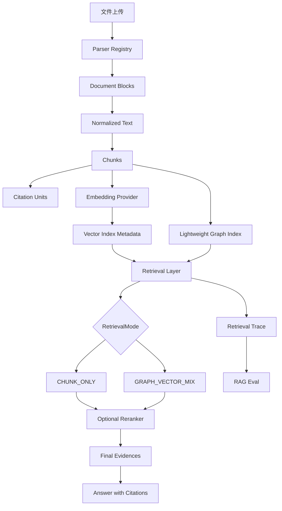

# PureLink RAG 项目讲解稿

## 1. 项目背景

PureLink 是一个面向个人和团队知识库的系统。用户可以上传文档，团队可以通过审核流程共享知识，系统通过 RAG 支持基于文档的问答，并返回可追踪的 citation。

这个项目不是只做一个“调用大模型回答问题”的 demo，而是把团队知识库产品层和工程化 RAG 内核放在一起：权限、审核、文档状态、异步处理、索引、检索、引用、trace 和 eval 都在同一个闭环里。

## 2. 初版 RAG 流程

初版流程是典型的文本 RAG：

```text
上传文件 -> 异步解析 -> chunk -> embedding -> 检索 -> LLM 回答 -> citation
```

它能工作，但问题也比较明显：

- 检索逻辑和 QA 编排耦合。
- 模型接入不够标准化。
- 没有第二阶段 rerank。
- 系统不知道索引是用哪个 embedding provider/model/dim 生成的。
- 检索过程不可观测，答错时难以定位问题。
- 文档结构被压平成文本流。
- 缺少实体/关系层，无法做 graph-aware retrieval。

## 3. RAG v2 改造主线

### M1 Retrieval Layer

M1 把检索从 QA service 中抽出来，形成统一的 `retrieval_service.retrieve()`。

核心类型是：

- `RetrievalRequest`
- `RetrievedEvidence`
- `RetrievalResult`
- `RetrievalMode`

这样 QA service 只需要拿 evidence 和 context 去生成答案，不再关心 chunk retrieval、citation-ready evidence、context builder 等细节。这个边界让后续 reranker、trace、GraphRAG 都有稳定接入口。

### M2 Provider Layer

M2 抽象了模型接入层：

- `EmbeddingProvider`
- `RerankerProvider`
- `LLMProvider`

这样业务逻辑不依赖某个具体模型实现。Core 默认仍然保持轻量本地配置，增强模式可以在后续切换到更强 embedding、reranker 或 OpenAI-compatible provider。

### M3 Optional Reranker

M3 把检索升级为两阶段：

```text
initial recall -> optional rerank -> final evidence selection
```

embedding retrieval 负责召回，reranker 对 query-document pair 做更精细排序。`rerank_score` 和 vector score 不同：前者是第二阶段相关性分数，后者是向量召回阶段的相似度信号。

### M4 Index Metadata

M4 增加 `document_indexes`。

原因是不同 embedding model 生成的向量不能混用。例如 `bge-small` 和 `bge-m3` 的 embedding space 不同，维度也可能不同。如果用户换了模型但继续用旧向量，检索质量会变得不可控。

`document_indexes` 记录 provider、model、dim、version 和 status，用于识别 stale/incompatible index。

### M5 Retrieval Trace

M5 让检索过程可观测。

trace 可以回答：

- 初始候选有哪些？
- 哪些证据进入了最终 context？
- reranker 是否改变排序？
- 哪些文档因为 index 不兼容被过滤？
- final answer 的 citation 来自哪个 evidence？

这让错误答案可以被拆解为解析、chunking、embedding、rerank、index、citation 或 prompt 问题。

### M6 Document Blocks

M6 把文档解析结果从纯文本升级为结构化 block：

```text
document -> blocks -> normalized text -> chunks
```

当前支持 heading、text、table、code，并保留 image/formula placeholder。这样后续可以做更精细的 chunking、table-aware retrieval、GraphRAG entity extraction 和多模态扩展。

### M8 RAG Eval

M8 增加 JSONL eval harness，用确定性指标评估 RAG：

- retrieval hit
- citation hit
- keyword coverage
- top-1/top-3 doc hit
- reranker usage
- trace availability

它不使用 LLM-as-judge，适合本地重复跑 baseline 和 regression。

### M7 Lightweight GraphRAG

M7 加入轻量 GraphRAG，但没有复刻完整 LightRAG。

实现包括：

- `knowledge_entities`
- `knowledge_relations`
- `entity_mentions`
- local rule graph extractor
- `GRAPH_VECTOR_MIX`

Graph extraction 从 chunk/citation unit 中提取实体和关系，关系尽量绑定到 source document、chunk、citation unit。查询时先匹配 query entity，再取 graph candidates，与 vector candidates 合并，最后复用已有 reranker 和 citation 机制。

## 4. 当前系统架构



## 5. 当前项目亮点

- 工程化 RAG 内核，不是单脚本 demo。
- citation-aware retrieval，答案来源由后端生成和校验。
- optional reranker，默认关闭但可配置。
- index metadata，避免 embedding model 切换后混用旧向量。
- retrieval trace，可调试候选、分数、过滤原因和最终证据。
- DocumentBlock parser routing，为结构化解析、表格和 GraphRAG 打基础。
- lightweight GraphRAG，实体/关系信号与 vector retrieval 合并。
- JSONL eval harness，用固定 case 做 retrieval/citation baseline。
- 团队知识库、权限、审核流和文档状态都和 RAG 链路结合。

## 6. 当前限制

- GraphRAG 是 lightweight、rule-based，不是完整 LightRAG。
- 没有复杂多跳推理和 graph community detection。
- 没有外部图数据库。
- 不是完整多模态 RAG，没有默认 OCR/VLM。
- 还没有 Agent runtime 和工具编排。
- eval 目前是确定性指标，不包含 LLM-as-judge。

## 7. 后续计划

- Agent-ready tools：`retrieve_knowledge`、`read_document`、`compare_documents`。
- 更强 graph extraction：可选 LLM extractor 或更好的规则/NER。
- 更完善 eval baseline：更多真实 KB case 和模式对比。
- 可选 `bge-m3` / `bge-reranker-v2-m3` preset。
- human-in-the-loop RAG workflow：人工审核、反馈和 reindex。
