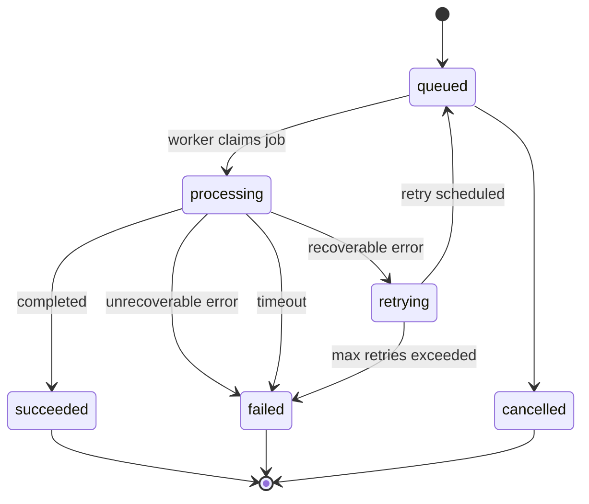

# ProcessingJob 状态机

## 状态列表

PureLink Core 当前使用统一的 `ProcessingJob.status`：

- `queued`
- `processing`
- `retrying`
- `succeeded`
- `failed`
- `cancelled`

这些状态适用于：

- `document_process`
- `document_index`
- `reindex`

## 状态流转图

## 关键字段说明

### `retry_count`

当前已经重试了多少次。

### `max_retries`

允许的最大重试次数。

### `locked_by`

当前抢占并执行这条 job 的 worker 标识。

### `locked_at`

worker 抢占这条 job 的时间。

### `timeout_at`

用于超时判定的时间点。超过后可以将 job 标记为失败。

### `started_at`

job 真正开始执行的时间。

### `finished_at`

job 成功或失败结束的时间。

### `error_code`

结构化失败码，便于 API、前端和排查复用。

### `error_message`

面向管理员或排障的错误说明。

## 为什么需要 ProcessingJob

`Document` 和 `ProcessingJob` 解决的是两个不同问题：

- `Document` 表示文件最终状态
- `ProcessingJob` 表示一次具体的处理任务

这样做的意义：

- 一个文档可以经历多次 `reprocess` / `reindex`
- 失败和重试可以被单独追踪
- worker、队列、失败步骤都有独立排查对象
- 文档状态和任务状态可以区分开，不会混在一张表里
