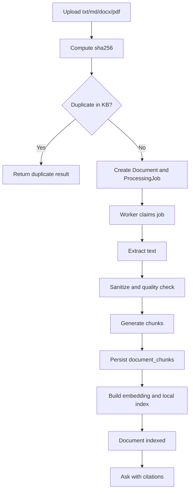

# 处理流水线

本文说明 PureLink Core 从上传文件到问答的主链路。

## 1. Upload 阶段

上传入口会完成以下动作：

1. 文件类型校验：当前默认只支持 `txt` / `md` / `docx` / 普通文本型 `pdf`
2. 文件大小校验
3. 计算 `sha256`
4. 检查同一个 knowledge base 内是否已存在相同文件
5. 保存文件
6. 创建 `Document`
7. 创建 `ProcessingJob`

这一步不做同步文本解析，也不做 embedding。

## 2. Process 阶段

worker 从 Redis 取出 job 后，会先在数据库里原子抢占：

```text
queued -> processing
```

随后根据文件类型选择 extractor：

- txt：直接读取文本
- md：直接读取文本并抽取 heading
- docx：提取 WordprocessingML 正文与 heading
- pdf：通过 PyMuPDF 提取文本

然后进入统一文本处理：

- text sanitation
- quality detection
- chunk 生成
- chunk metadata 构建
- persist chunks

如果文本质量过低，chunk 不会入库，任务会带明确 `error_code` 失败。

## 3. Index 阶段

在 chunk 已经存在的前提下，系统会：

- 使用 `fastembed` 生成向量
- 写入本地 vector index
- 写入 index metadata
- 将文档状态推进到 `indexed`

默认 embedding provider：

```env
EMBEDDING_PROVIDER=fastembed
EMBEDDING_MODEL=BAAI/bge-small-zh-v1.5
```

## 4. Ask 阶段

问答主链路：

1. 问题进入检索
2. 只在 `indexed` 文档范围内做 retrieval，并返回相关 chunks
3. 如果最高分低于 `RETRIEVAL_MIN_SCORE`，不强答
4. 否则构建上下文
5. 由 `LLM_PROVIDER` 或 `heuristic` 生成 answer
6. 后端基于 retrieval results 生成 citations
7. 前端展示 answer + 参考来源

## 5. 主路径图


