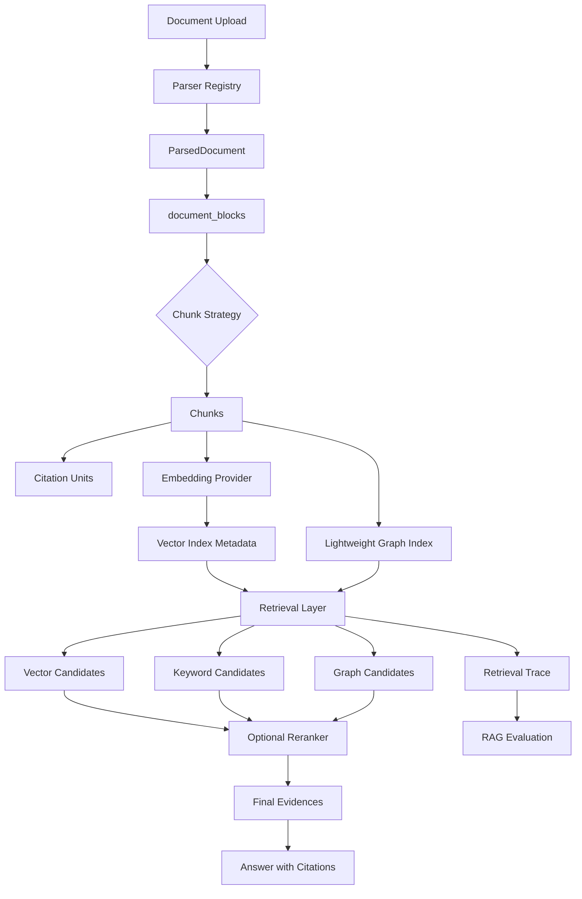

# RAG Pipeline

PureLink RAG v2 keeps ingestion, retrieval, citations, trace, and evaluation as separate but connected layers.

```text
upload -> parser registry -> ParsedDocument -> document_blocks -> chunk strategy -> chunks
  -> citation_units -> embedding provider -> document_indexes.vector
  -> retrieval mode -> vector/keyword/graph candidates -> optional reranker -> final evidence
  -> answer with citations -> retrieval trace -> eval
```



Key design choices:

- Retrieval returns evidence; answer generation does not own retrieval details.
- Citations are backend-generated from selected evidence.
- Index metadata prevents silent embedding model mismatch.
- Trace and eval make retrieval behavior debuggable and measurable.
- GraphRAG is an optional augmentation, not the default path.
- `HYBRID_TEXT` is an optional vector + keyword mode for technical terms such as API paths, config keys, file names, commands, error codes, and migration ids.

## Chunk Strategies

`CHUNK_STRATEGY=fixed` is the default and keeps existing flat-text chunking behavior.

`CHUNK_STRATEGY=block_aware` uses `DocumentBlock` structure to produce section-aware chunks. It preserves heading context, avoids arbitrary splitting of small tables, treats code blocks separately, and falls back to fixed chunking if block data is unavailable.

## Hybrid Text Retrieval

`RetrievalMode.HYBRID_TEXT` runs the normal chunk retrieval path and adds a deterministic keyword retriever. Keyword candidates are scored by local term overlap and then merged with vector candidates before optional reranking.

This improves recall for exact technical text. It is intentionally lightweight and does not require Elasticsearch, OpenSearch, or a PostgreSQL full-text migration.
