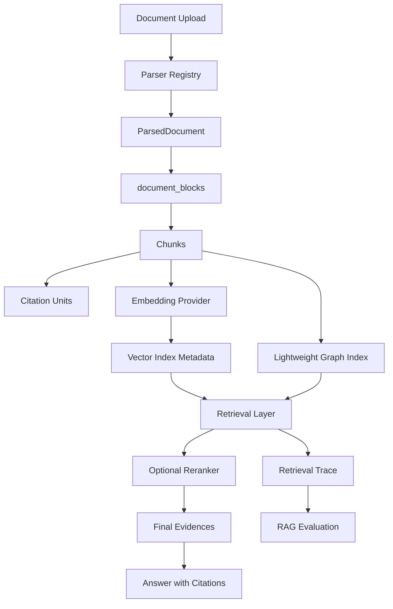

# RAG Pipeline

PureLink RAG v2 keeps ingestion, retrieval, citations, trace, and evaluation as separate but connected layers.

```text
upload -> parser registry -> ParsedDocument -> document_blocks -> chunks
  -> citation_units -> embedding provider -> document_indexes.vector
  -> retrieval mode -> optional reranker -> final evidence
  -> answer with citations -> retrieval trace -> eval
```



Key design choices:

- Retrieval returns evidence; answer generation does not own retrieval details.
- Citations are backend-generated from selected evidence.
- Index metadata prevents silent embedding model mismatch.
- Trace and eval make retrieval behavior debuggable and measurable.
- GraphRAG is an optional augmentation, not the default path.
