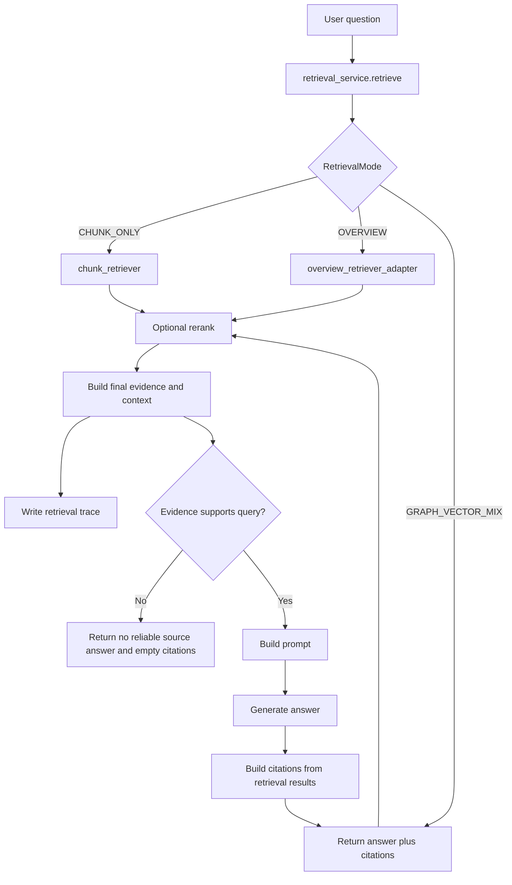

# 检索与 Citations

## 1. chunk metadata 规范

PureLink Core 当前支持四类默认来源。

### txt

- `source_type=text`
- `source_locator=chars:start-end` or `section:title`
- `extractor=text` or `text:structured`

Markdown-like `.txt` files can be parsed into structured text blocks when the
file contains multiple valid headings and body text. The source type remains
`text`; the structured parser only improves block, section, and citation
metadata.

### markdown

- `source_type=markdown`
- `source_locator=heading:title` 或 `markdown:chunk:n`
- `extractor=markdown`

### docx

- `source_type=docx`
- `source_locator=section:title` 或 `chars:start-end`
- `extractor=minimal_docx_text`

### pdf

- `source_type=pdf`
- `page_number=n`
- `source_locator=page:n`
- `extractor=pymupdf`

## 2. AskResponse 结构

ask 接口返回结构：

- `answer`
- `citations`

其中 `citations` 是后端根据 retrieval results 生成的结构化来源列表。

## 3. Retrieval Layer

问答入口先调用 `app/services/retrieval/retrieval_service.py` 中的 `retrieve()`，再把返回的 `RetrievalResult` 交给 QA answer generation。

当前支持的检索模式：

- `RetrievalMode.AUTO`：规则版 Query Router，先根据 query 选择真实检索模式
- `RetrievalMode.CHUNK_ONLY`：复用当前 chunk-level hybrid 检索、rerank 和 DB fallback 行为
- `RetrievalMode.OVERVIEW`：通过 adapter 复用现有 overview 检索
- `RetrievalMode.GRAPH_VECTOR_MIX`：先取 vector candidates，再加入轻量 graph candidates，合并后可交给 reranker
- `RetrievalMode.HYBRID_TEXT`：将 keyword candidates 与 vector candidates 合并，用于 API path、配置项、文件路径、命令、错误码等精确技术词

未来模式（如 graph local / global）仍然保留为占位，当前会 fallback 到 `CHUNK_ONLY`。

`RetrievalResult` 会包含：

- `evidences`：citation-ready evidence
- `context_text`：带 `[S1]` / `[S2]` 标记的 LLM context
- `requested_mode` / `selected_mode` / `effective_mode`：记录用户请求模式、规则路由模式和 fallback 后实际执行模式
- `router_reason` / `router_confidence`：记录规则 router 原因和置信度
- `fallback_mode` / `fallback_reason`：记录 graph/hybrid 保守 fallback
- `metadata.context_chunks`：保留给当前 QA prompt 和可靠性判断使用的 chunk 对象
- `metadata.evidence_units`：保留给当前 citation 生成使用的 citation unit 候选

`AUTO` 是 deterministic rule-based router，不是 LLM classifier 或 Agent。当前优先级为：

```text
overview > relation > exact technical identifier > chunk_only
```

低置信度或弱关键词默认回到 `chunk_only`。手动指定 `chunk_only`、`overview`、`graph_vector_mix` 或 `hybrid_text` 时不会被 router 覆盖。

`selected_mode` 表示 router 选择的模式，`effective_mode` 表示 fallback 后实际执行的模式。这样 eval 可以继续衡量 router 分类准确性，同时 trace 能说明实际检索是否从 `graph_vector_mix` 或 `hybrid_text` 回退到 `chunk_only`。

### Citation Readiness

`RetrievalResult.evidences` is the canonical source for both answer context and
citations. QA does not rebuild citations independently from raw retrieved
chunks, because that could make the answer use one fact while the citation
points to another.

A citation-ready evidence requires both a persisted `citation_unit_id` and a
stable `source_locator`. It also preserves document and chunk identifiers,
source type, page or character range, section title, and heading path when
available. Unit-level provenance takes precedence; chunk metadata only fills a
field that the unit does not provide.

When query-specific unit selection returns no units, the retrieval layer may
expand the already selected context chunks into their persisted citation
units. The fallback keeps context chunk order, admits at most two units per
chunk, observes the existing global evidence-unit limit, and keeps the rendered
evidence context within the existing character budget. It does not rerun
retrieval, read unselected or broad parent chunks, or invent a unit id. A
legacy chunk without persisted units remains usable as answer evidence but is
explicitly not citation-ready. Likewise, the system does not fabricate a
precise locator from a database id, trace id, or vector index id.

Locator precedence follows the existing source formats:

1. citation-unit `source_locator`;
2. unit page/time/section or character range metadata;
3. corresponding chunk metadata only when the unit field is absent.

Exact duplicate evidence from the same document and chunk prefers the version
with complete citation-unit provenance. Retrieval trace metadata records
`citation_ready_count`, `citation_missing_count`, and grouped
`citation_missing_reasons`; final trace items record `citation_ready` and
`citation_readiness_reason` in their JSON metadata.

Citation Readiness and the Evidence Support Gate are independent checks. The
Support Gate decides whether the selected evidence can answer the question;
Citation Readiness decides whether that evidence can be linked to a stable
source. Citation readiness does not by itself prove that an answer is correct.

Conversation 中追加消息时默认请求 `AUTO`。当前用户问题保存在
`evidence_query`，用于 deterministic rule-based Router、evidence profile 和
Evidence Support Gate；实际检索使用的 `query` 可以包含最近对话上下文。
这样历史消息中的总结、配置键或关系词不会污染当前问题的模式选择，
同时 follow-up 仍保留对话增强召回。conversation trace 关联
`conversation_id`，并通过 `routing_query_source` 记录 Router 使用了哪个字段。
unsupported evidence 会跳过 answer provider、返回无可靠证据文案并保持空
citations，现有 conversation response schema 不变。

保守 fallback：

- `graph_vector_mix` 在 graph candidates 为空、低于阈值或 graph 检索失败时 fallback 到 `chunk_only`。
- `hybrid_text` 在 keyword candidates 为空、keyword 检索失败或没有额外 keyword signal 时保留 vector candidates，并记录 fallback metadata。

失败响应不改变成功的 ask/retrieval schema。Ask 和 Retrieval Debug 的失败
会返回统一 API error envelope，前端显示 error code、message 和 request id
以便排查；citation 和 retrieval trace 仍只出现在成功响应中。

## 4. Model Provider Layer

M2/M3 新增 `app/providers/`，用于把模型接入层和业务流程解耦。

- Retrieval layer 只负责请求 evidence，不直接绑定具体模型实现。
- Embedding provider 负责 query/chunk vector 生成；当前默认仍为轻量 fastembed 配置。
- Reranker provider 默认是 no-op/disabled；M3 已把可选 reranker 接入 retrieval pipeline。
- LLM provider 接口已经准备好；主 QA 生成路径仍沿用现有 `qa.py` answer generator，后续可渐进迁移。

### Optional Reranking

Reranker 不是 embedding retrieval 的替代品，而是第二阶段排序：

```text
embedding retrieval -> initial candidates -> reranker -> final evidences
```

- embedding retrieval 负责初始召回。
- reranker 接收 query + evidence text pairs。
- 启用 reranker 时，`RetrievedEvidence.rerank_score` 会记录重排分数。
- final selected evidences 会用于 `context_text` 构建。
- citations 只基于 final selected evidences。
- no-op reranker 会保持当前行为和顺序。

后续里程碑：

- M4：增加 index metadata，避免 embedding model 切换后复用旧向量索引。

## 5. Index Metadata

M4 新增 `document_indexes`，用于记录每个文档的检索索引生命周期。

- `documents.processing_status` 描述文档处理生命周期。
- `document_indexes.status` 描述检索索引生命周期。
- 当前实现写入 `vector` index metadata。
- 保留 `graph` 和 `lexical` index type，供后续 GraphRAG / hybrid index 使用。
- vector index 记录 `provider`、`model_name`、`model_dim` 和 `model_version`。
- 检索会检查已有 index metadata 是否匹配当前 embedding 配置。
- M4 对旧数据保持兼容：没有 `document_indexes` 记录的 legacy 文档仍可检索。

切换 `EMBEDDING_PROVIDER` 或 `EMBEDDING_MODEL` 后，已有向量不会自动变成兼容索引。后续 rebuild workflow 需要基于 `document_indexes` 找出 stale index 并重新生成向量。

## 6. Retrieval Trace

M5 新增 retrieval trace，用于调试和评估 RAG 检索质量。

- trace 由 `retrieval_service.retrieve()` 生成。
- trace header 记录 query、retrieval mode、top_k、provider metadata、reranker 配置、初始候选数量和最终 evidence 数量。
- trace metadata 记录 `requested_mode`、`selected_mode`、`effective_mode`、`router_reason`、`router_confidence`、`router_type`、`fallback_mode` 和 `fallback_reason`。
- trace item 关联 document、chunk、citation unit。
- trace item 记录 initial rank、rerank rank、final rank、vector score、rerank score、final score。
- trace item 标记 `selected_for_context`，说明哪些 evidence 进入最终 context。
- trace item 可记录 filtered reason，例如 incompatible index、stale index、not selected after rerank。
- candidate text preview 会截断；trace 不存完整 LLM prompt。
- citation 行为仍只依赖最终 selected evidence，trace 不参与 answer generation。

更新后的检索链路：

```text
query
  -> retrieval mode
  -> index compatibility filtering
  -> initial candidates
  -> optional graph candidates
  -> optional rerank
  -> final evidences
  -> context
  -> citations
  -> trace record
```

## 7. RAG Evaluation

M8 新增轻量 RAG evaluation harness，用固定 JSONL case 衡量检索质量。

- case 定义在 `tests/eval/purelink_rag_cases.jsonl`。
- runner 位于 `scripts/eval/run_rag_eval.py`。
- 指标包括 retrieval hit、citation hit、keyword coverage、used reranker 和 trace availability。
- metric 使用确定性规则，不依赖 LLM-as-judge。
- 默认 case 是模板，需要替换成本地 KB id、user id 和 expected document names。
- evaluation 可以读取 `RetrievalResult.trace_id`，用于把评估结果和 M5 retrieval trace 关联起来。

示例：

```bash
.venv/bin/python scripts/eval/run_rag_eval.py \
  --cases tests/eval/purelink_rag_cases.jsonl \
  --output tests/eval/reports/latest.json
```

## 8. Lightweight GraphRAG

M7 新增轻量 GraphRAG prototype。它不是完整 LightRAG 复刻，也不引入 Neo4j/Memgraph。

当前 graph 层包含：

- `knowledge_entities`
- `knowledge_relations`
- `entity_mentions`
- `document_indexes.graph`

Graph extraction 使用本地规则，从 chunks / citation units 中抽取实体、关系和 mention。关系会尽量记录：

- source document
- source chunk
- source citation unit

`GRAPH_VECTOR_MIX` 检索流程：

```text
query
  -> vector candidates
  -> query entity matching
  -> graph relation / mention candidates
  -> candidate merge and dedup
  -> optional rerank
  -> final evidence
  -> citations
  -> trace
```

Graph candidates 会写入 `RetrievedEvidence.graph_score`。最终回答仍然只使用 final selected evidence，并保持 citation-unit grounding。

## 9. Document Blocks

M6 新增结构化文档 block 层：

```text
document -> blocks -> chunks -> citation units -> embeddings -> retrieval
```

- `document_blocks` 保存解析后的 heading、text、table、code 等结构。
- `ParsedDocument.text` 保持向后兼容，现有 chunking 仍可接收 plain text。
- chunks 仍是当前 retrieval unit。
- citation units 仍是当前 source grounding unit。
- blocks 主要用于保留源文档结构，为后续 table-aware chunking、更精细 locator、GraphRAG 和多模态 parser 预留基础。
- M6 不实现 OCR、VLM，也不把 chunks/citation units 强制绑定到 block_id。

当前 parser routing：

- `.txt` -> TextParser
- `.md` -> MarkdownParser
- `.docx` -> DocxParser
- `.pdf` -> PdfTextParser

Citation-unit generation now uses chunk source spans when available. Those spans
preserve processed-document char ranges, PDF page numbers, heading paths,
section titles, line roles, and extractor metadata across both fixed and
block-aware chunking. Citation units respect hard boundaries such as blocks,
pages, headings, field-like lines, and list items; short field facts with both
label and value are preserved, while heading-only or other low-value fragments
are filtered.

Technical tokens remain semantically intact during inline-format cleanup, and
sentence segmentation does not split decimals, versions, IP addresses,
filenames, or module paths at internal periods. The persisted unit text and its
character range therefore refer to the same processed-source fact.

Existing processed documents are not rewritten automatically. To apply updated
block or citation-unit rules to old data, reprocess the document and rebuild its
vector index. This does not require a database schema migration.

## 10. Document Processing Inspector

M19 adds a document status endpoint and Documents-tab inspector UI so users can
debug RAG readiness without reading backend logs.

Personal KB:

```text
GET /api/v1/knowledge-bases/{kb_id}/documents/{document_id}/status
```

Team KB:

```text
GET /api/v1/teams/{team_id}/knowledge-bases/{kb_id}/documents/{document_id}/status
```

The response includes document basics, processing status, `rag_ready`, block
count, chunk count, citation-unit count, vector index status/count, graph index
status, entity/relation counts, latest processing step, errors, warnings, and a
checklist suitable for UI display.

Base RAG ready is true only when:

- processing status is not `failed`
- chunks exist
- citation units exist
- vector index is ready and compatible
- vector index count is non-zero
- no document/job/index error message is present

Graph index readiness is reported separately. A missing graph index is optional
for base RAG and should be shown as a warning or optional check; it only affects
Graph Explorer and `graph_vector_mix` quality.

Troubleshooting examples:

- `chunk_count=0`: parsing may have succeeded but chunk persistence did not run or failed.
- `citation_unit_count=0`: citations cannot be grounded even if chunks exist.
- `vector_index_status=missing`: retrieval cannot use the document in normal RAG yet.
- `vector_index_status=warning`: the vector index may be stale or incompatible with the current embedding provider/model.
- `graph_index_status=missing`: base Q&A can still work, but graph features may have no candidates.
- `error_code` / `error_message`: use the latest processing job details to identify the failed step.

## 11. Public Citation Contract

Personal KB ask、Team KB ask 和 Conversation message 共用同一个
`CitationRead` response model。前端也使用一个共享 Citation schema 解析三类响应。
Citation UI 的事实文本只来自回答实际引用的 final evidence；provider marker、
final evidence 和返回 citation 一一对应。未被 marker 引用的候选、broad parent
chunk、conversation history 或模型生成摘要不会成为 citation text。

稳定的 UI contract 字段如下：

| Field | Source | Meaning |
|---|---|---|
| `citation_marker` | provider marker + allowed final evidence | Answer-local marker，例如 `S1` |
| `document_name` | final evidence | 来源文件名；缺失时保持 `null` |
| `text` | final evidence | 被回答实际引用的 evidence unit 全文 |
| `source_locator` | citation-unit provenance | 结构化 locator；缺失时保持 `null` |
| `source_type` | citation unit / final evidence | `text`、`pdf`、`docx` 等来源类型 |
| `section_title` | citation-unit provenance | 章节标题；未知时为 `null` |
| `heading_path` | citation-unit provenance | 稳定字符串数组；缺失时为 `[]` |
| `page_number` | citation-unit provenance | PDF 页码；非分页来源通常为 `null` |
| `char_start` / `char_end` | citation-unit provenance | 成对出现的有效字符范围，否则两者均为 `null` |
| `citation_ready` | persisted unit id + stable locator | 是否具备可追溯 provenance，不固定写为 `true` |
| `retrieval_mode` | final evidence / effective retrieval mode | 本次实际检索模式；无法可靠确定时为 `null` |
| `score` | final evidence `final_score` | 最终 evidence 分数，不是 Support Gate score |

`source_locator` 内部会按来源类型保留 page、section、character range 或
time range。PDF citation 使用 `page_number`；文本 citation 使用有效的
`char_start` / `char_end` 或 section metadata。系统不会根据文件名猜测 section，
也不会在 locator 缺失时伪造定位信息。

为保持已有 API 和 document preview 链接兼容，response 目前仍可能携带
`document_id`、`citation_unit_id`、`chunk_id`、`knowledge_base_id` 等 legacy
内部标识。它们不属于新的 Citation UI contract，前端共享 Citation 类型不把
这些 ID 设为必需字段，列表 key 使用 marker 加 answer-local index。新的 UI
不得显示或依赖 trace id、user id、KB id、chunk id 或 citation-unit id。

### 11.1 Clickable Citation Details

Personal KB、Team KB 和 Conversation 的回答正文共用同一个 citation-aware
renderer。回答中的 `[S1]` 是 answer-local citation reference；旧回答中的 `[1]`
可兼容映射到 `citation_marker=S1`。只有能匹配当前公开 Citation 数据的 marker
才会显示为可点击按钮。未知、格式错误或 Markdown link 中的 marker 会保留为
普通文本，不会猜测或生成来源。

点击 marker 会打开右侧 Citation Drawer。Drawer 展示该 marker 实际引用的
final evidence text，以及真实存在的 source type、section、heading path、PDF page、
character range、retrieval mode 和 final evidence score。定位信息缺失时保持为空；
`citation_ready=false` 只提示来源详情有限，不会伪造 provenance。存在可靠 preview
target 时可以沿用现有 document preview 链接查看来源。

Drawer 完全使用当前回答已经返回的 Citation 数据，不会重新请求 API、运行 retrieval
或展示其他未引用 evidence。界面不展示 document、chunk、citation-unit、KB、trace
等内部 ID。完整来源列表仍由现有 EvidencePanel 和 CitationCard 提供。

## 12. Evidence Support Gate

PureLink Core separates retrieval relevance from answer support. A high-scoring
chunk can be topically similar but still fail to answer the exact fact requested
by the user.

After final evidence selection and before the answer provider is called, the QA
service runs a deterministic Evidence Support Gate. The gate uses query-type
mandatory checks plus soft support signals:

- entity definition questions require entity/concept coverage plus definition,
  identity, role, or concept-description evidence;
- entity attribute questions require the requested attribute slot, such as
  location, birthday, color, weight, processor, responsibility, configuration,
  or default value;
- reason questions look for purpose, cause, benefit, or effect signals;
- relation questions look for relation expressions and entity coverage;
- exact technical questions look for exact identifiers or their stable parts;
- overview questions stay looser and require non-empty overview evidence.

The support score is a debugging signal, not a factual correctness score. The
gate does not call an LLM and is not a semantic entailment model.

Unsupported questions return `citations=[]` and skip the heuristic / DeepSeek /
OpenAI-compatible answer provider.

固定提示为：

```text
当前知识库中没有找到足够可靠的依据，无法确认该问题。
```

## 13. 为什么 citations 由后端生成

原因很明确：

- 防止大模型编造来源
- 保证来源能追踪到真实 chunk
- 让前端能直接基于结构化数据展示来源
- 为后续继续扩展 preview / 定位提供基础

## 14. 问答流程图


