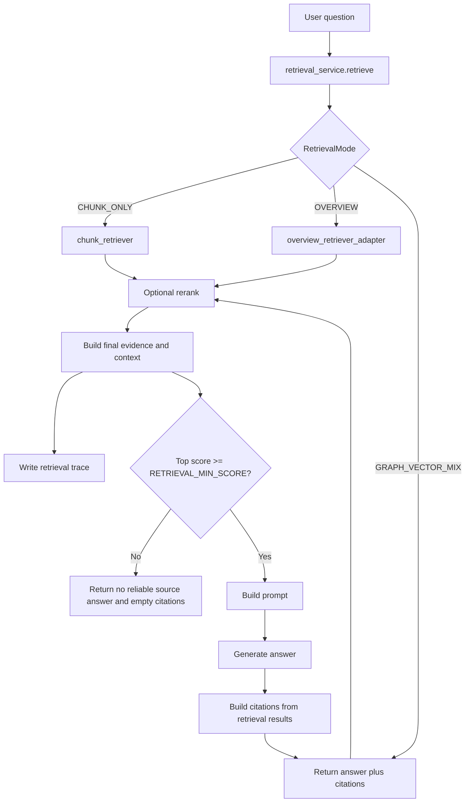

# 检索与 Citations

## 1. chunk metadata 规范

PureLink Core 当前支持四类默认来源。

### txt

- `source_type=text`
- `source_locator=text:chunk:n`
- `extractor=text`

### markdown

- `source_type=markdown`
- `source_locator=heading:title` 或 `markdown:chunk:n`
- `extractor=markdown`

### docx

- `source_type=docx`
- `source_locator=section:title` 或 `chars:start-end`
- `extractor=minimal_docx_text`

### pdf

- `source_type=pdf`
- `page_number=n`
- `source_locator=page:n`
- `extractor=pymupdf`

## 2. AskResponse 结构

ask 接口返回结构：

- `answer`
- `citations`

其中 `citations` 是后端根据 retrieval results 生成的结构化来源列表。

## 3. Retrieval Layer

问答入口先调用 `app/services/retrieval/retrieval_service.py` 中的 `retrieve()`，再把返回的 `RetrievalResult` 交给 QA answer generation。

当前支持的检索模式：

- `RetrievalMode.CHUNK_ONLY`：复用当前 chunk-level hybrid 检索、rerank 和 DB fallback 行为
- `RetrievalMode.OVERVIEW`：通过 adapter 复用现有 overview 检索
- `RetrievalMode.GRAPH_VECTOR_MIX`：先取 vector candidates，再加入轻量 graph candidates，合并后可交给 reranker

未来模式（如 hybrid text、graph local / global）仍然保留为占位，当前会 fallback 到 `CHUNK_ONLY`。

`RetrievalResult` 会包含：

- `evidences`：citation-ready evidence
- `context_text`：带 `[S1]` / `[S2]` 标记的 LLM context
- `metadata.context_chunks`：保留给当前 QA prompt 和可靠性判断使用的 chunk 对象
- `metadata.evidence_units`：保留给当前 citation 生成使用的 citation unit 候选

## 4. Model Provider Layer

M2/M3 新增 `app/providers/`，用于把模型接入层和业务流程解耦。

- Retrieval layer 只负责请求 evidence，不直接绑定具体模型实现。
- Embedding provider 负责 query/chunk vector 生成；当前默认仍为轻量 fastembed 配置。
- Reranker provider 默认是 no-op/disabled；M3 已把可选 reranker 接入 retrieval pipeline。
- LLM provider 接口已经准备好；主 QA 生成路径仍沿用现有 `qa.py` answer generator，后续可渐进迁移。

### Optional Reranking

Reranker 不是 embedding retrieval 的替代品，而是第二阶段排序：

```text
embedding retrieval -> initial candidates -> reranker -> final evidences
```

- embedding retrieval 负责初始召回。
- reranker 接收 query + evidence text pairs。
- 启用 reranker 时，`RetrievedEvidence.rerank_score` 会记录重排分数。
- final selected evidences 会用于 `context_text` 构建。
- citations 只基于 final selected evidences。
- no-op reranker 会保持当前行为和顺序。

后续里程碑：

- M4：增加 index metadata，避免 embedding model 切换后复用旧向量索引。

## 5. Index Metadata

M4 新增 `document_indexes`，用于记录每个文档的检索索引生命周期。

- `documents.processing_status` 描述文档处理生命周期。
- `document_indexes.status` 描述检索索引生命周期。
- 当前实现写入 `vector` index metadata。
- 保留 `graph` 和 `lexical` index type，供后续 GraphRAG / hybrid index 使用。
- vector index 记录 `provider`、`model_name`、`model_dim` 和 `model_version`。
- 检索会检查已有 index metadata 是否匹配当前 embedding 配置。
- M4 对旧数据保持兼容：没有 `document_indexes` 记录的 legacy 文档仍可检索。

切换 `EMBEDDING_PROVIDER` 或 `EMBEDDING_MODEL` 后，已有向量不会自动变成兼容索引。后续 rebuild workflow 需要基于 `document_indexes` 找出 stale index 并重新生成向量。

## 6. Retrieval Trace

M5 新增 retrieval trace，用于调试和评估 RAG 检索质量。

- trace 由 `retrieval_service.retrieve()` 生成。
- trace header 记录 query、retrieval mode、top_k、provider metadata、reranker 配置、初始候选数量和最终 evidence 数量。
- trace item 关联 document、chunk、citation unit。
- trace item 记录 initial rank、rerank rank、final rank、vector score、rerank score、final score。
- trace item 标记 `selected_for_context`，说明哪些 evidence 进入最终 context。
- trace item 可记录 filtered reason，例如 incompatible index、stale index、not selected after rerank。
- candidate text preview 会截断；trace 不存完整 LLM prompt。
- citation 行为仍只依赖最终 selected evidence，trace 不参与 answer generation。

更新后的检索链路：

```text
query
  -> retrieval mode
  -> index compatibility filtering
  -> initial candidates
  -> optional graph candidates
  -> optional rerank
  -> final evidences
  -> context
  -> citations
  -> trace record
```

## 7. RAG Evaluation

M8 新增轻量 RAG evaluation harness，用固定 JSONL case 衡量检索质量。

- case 定义在 `tests/eval/purelink_rag_cases.jsonl`。
- runner 位于 `scripts/eval/run_rag_eval.py`。
- 指标包括 retrieval hit、citation hit、keyword coverage、used reranker 和 trace availability。
- metric 使用确定性规则，不依赖 LLM-as-judge。
- 默认 case 是模板，需要替换成本地 KB id、user id 和 expected document names。
- evaluation 可以读取 `RetrievalResult.trace_id`，用于把评估结果和 M5 retrieval trace 关联起来。

示例：

```bash
.venv/bin/python scripts/eval/run_rag_eval.py \
  --cases tests/eval/purelink_rag_cases.jsonl \
  --output tests/eval/reports/latest.json
```

## 8. Lightweight GraphRAG

M7 新增轻量 GraphRAG prototype。它不是完整 LightRAG 复刻，也不引入 Neo4j/Memgraph。

当前 graph 层包含：

- `knowledge_entities`
- `knowledge_relations`
- `entity_mentions`
- `document_indexes.graph`

Graph extraction 使用本地规则，从 chunks / citation units 中抽取实体、关系和 mention。关系会尽量记录：

- source document
- source chunk
- source citation unit

`GRAPH_VECTOR_MIX` 检索流程：

```text
query
  -> vector candidates
  -> query entity matching
  -> graph relation / mention candidates
  -> candidate merge and dedup
  -> optional rerank
  -> final evidence
  -> citations
  -> trace
```

Graph candidates 会写入 `RetrievedEvidence.graph_score`。最终回答仍然只使用 final selected evidence，并保持 citation-unit grounding。

## 9. Document Blocks

M6 新增结构化文档 block 层：

```text
document -> blocks -> chunks -> citation units -> embeddings -> retrieval
```

- `document_blocks` 保存解析后的 heading、text、table、code 等结构。
- `ParsedDocument.text` 保持向后兼容，现有 chunking 仍可接收 plain text。
- chunks 仍是当前 retrieval unit。
- citation units 仍是当前 source grounding unit。
- blocks 主要用于保留源文档结构，为后续 table-aware chunking、更精细 locator、GraphRAG 和多模态 parser 预留基础。
- M6 不实现 OCR、VLM，也不把 chunks/citation units 强制绑定到 block_id。

当前 parser routing：

- `.txt` -> TextParser
- `.md` -> MarkdownParser
- `.docx` -> DocxParser
- `.pdf` -> PdfTextParser

## 10. AnswerCitation 字段

当前 citation 结构的核心字段包括：

- `document_id`
- `document_name` / filename
- `chunk_id`
- `source_type`
- `source_locator`
- `page_number`
- `snippet`
- `score`

此外还会保留：

- `knowledge_base_id`
- `scope`
- `team_id`
- `char_start`
- `char_end`
- `section_title`

## 11. 可靠来源策略

PureLink Core 使用 `RETRIEVAL_MIN_SCORE` 控制“是否有足够可靠的来源”。

规则：

- 如果没有检索到结果，直接返回固定提示
- 如果最高分低于 `RETRIEVAL_MIN_SCORE`，也返回固定提示
- 此时 `citations=[]`

固定提示为：

```text
当前知识库中没有找到足够可靠的依据，无法确认该问题。
```

## 12. 为什么 citations 由后端生成

原因很明确：

- 防止大模型编造来源
- 保证来源能追踪到真实 chunk
- 让前端能直接基于结构化数据展示来源
- 为后续继续扩展 preview / 定位提供基础

## 13. 问答流程图


