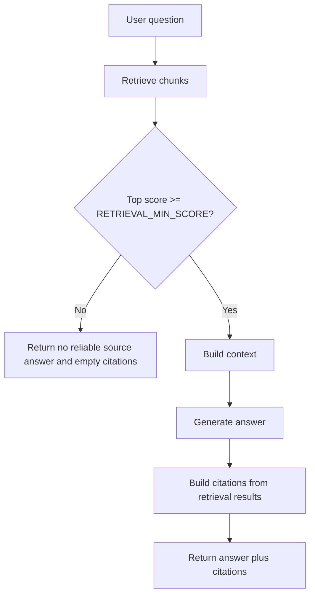

# 检索与 Citations

## 1. chunk metadata 规范

PureLink Core 当前支持三类默认来源。

### txt

- `source_type=text`
- `source_locator=text:chunk:n`
- `extractor=text`

### markdown

- `source_type=markdown`
- `source_locator=heading:title` 或 `markdown:chunk:n`
- `extractor=markdown`

### pdf

- `source_type=pdf`
- `page_number=n`
- `source_locator=page:n`
- `extractor=pymupdf`

## 2. AskResponse 结构

ask 接口返回结构：

- `answer`
- `citations`

其中 `citations` 是后端根据 retrieval results 生成的结构化来源列表。

## 3. AnswerCitation 字段

当前 citation 结构的核心字段包括：

- `document_id`
- `document_name` / filename
- `chunk_id`
- `source_type`
- `source_locator`
- `page_number`
- `snippet`
- `score`

此外还会保留：

- `knowledge_base_id`
- `scope`
- `team_id`
- `char_start`
- `char_end`
- `section_title`

## 4. 可靠来源策略

PureLink Core 使用 `RETRIEVAL_MIN_SCORE` 控制“是否有足够可靠的来源”。

规则：

- 如果没有检索到结果，直接返回固定提示
- 如果最高分低于 `RETRIEVAL_MIN_SCORE`，也返回固定提示
- 此时 `citations=[]`

固定提示为：

```text
当前知识库中没有找到足够可靠的依据，无法确认该问题。
```

## 5. 为什么 citations 由后端生成

原因很明确：

- 防止大模型编造来源
- 保证来源能追踪到真实 chunk
- 让前端能直接基于结构化数据展示来源
- 为后续继续扩展 preview / 定位提供基础

## 6. 问答流程图


